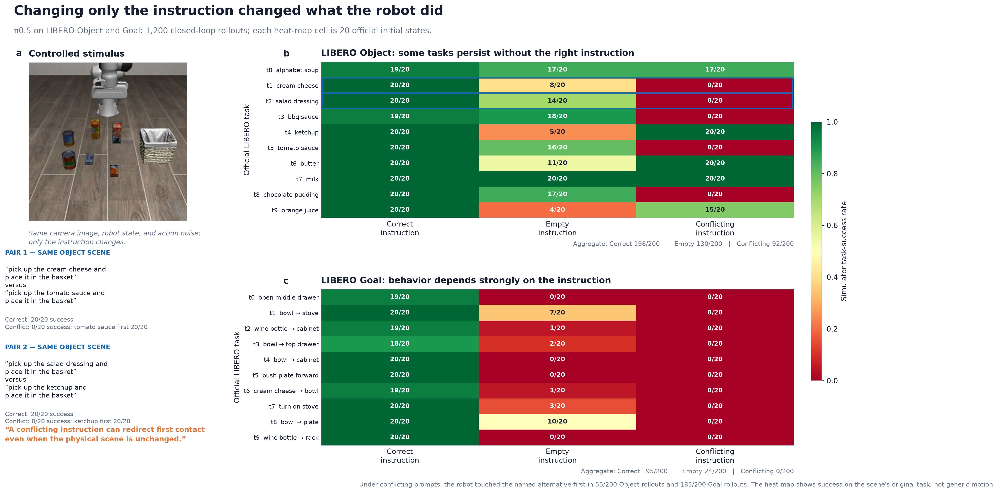
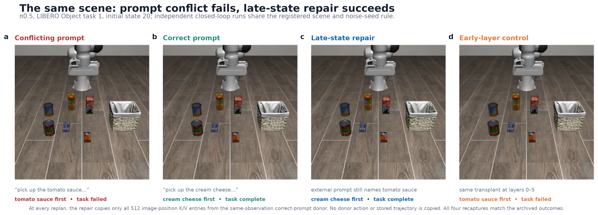

# Where does a robot policy keep the instruction it is following?

This repository is a causal interpretability study of **π0.5**, a vision-language-action model, with **OpenVLA-OFT** as an architecture boundary test.

We held the camera observation and robot state fixed, changed only the instruction, and then intervened on the model's internal state. The goal was not merely to find where the instruction could be decoded. It was to find the state that actually controls the action—and ask whether that state could be reduced to a small, reusable mechanism.

## The answer in one paragraph

In the tested π0.5 checkpoint, the instruction is used while the image-and-text prefix is built. After that, instruction identity remains readable at the text positions, but editing those positions barely changes the Goal action. Broad image-position state at late layers has much more causal leverage: transplanting it on every replan repaired `18/20` conflicted rollouts, while the same intervention at an early control band repaired `0/20`. A new paired preservation screen showed why this is causal control rather than a clean policy switch: late repair succeeded `9/10` versus clean `10/10`, with one wrong-first contact, one separate failure, and usually longer trajectories. Static directions, object-local patches, low-rank subspaces, donor-free operators, and compact writer rescues did not reproduce the broad effect. The **full instruction-dependent update across layers 6–8 transfers partly between initial scenes and depends strongly on the MLP sublayers**, but a simulator screen found only `3/12` B-first contacts and `0/12` B-task completions. The best current description is a broad multi-block handoff with local causal leverage—not a discovered instruction neuron, portable steering vector, or transferred policy.


## Five results worth remembering

| Result | Evidence | Why it matters |
|---|---:|---|
| Readable text is not the same as causal text | Text task decoding stayed `1.000` through layers 0–16, but post-prefill instruction K/V repair was `R=0.0106` | A probe can correctly report what information is present while pointing to the wrong causal site. |
| Late image-associated state can control behavior | Live L12–17 image-state repair: `18/20` successes; early L0–5 control: `0/20` | The intervention changed complete rollouts, not just an activation or one action vector. |
| Broad repair is not perfect preservation | New paired screen: repair `9/10`, clean `10/10`; one wrong-first contact; median `+15` steps | Benchmark success can hide a detour or collateral contact. |
| The broad state resisted compression | Object-local: `0/8`; Sonar joint endpoints: `0/12`; fixed L6–8 writer block/rescue: `0/8` | Causal leverage over a whole state is not yet a selective mechanism. |
| A full transformation transfers where compact pieces failed | Other-scene full L6→8 update: `0.2108` A→B progress; random: `0.0058`; full beat attention-only in `12/12` | The useful unit is a multi-block attention+MLP computation, not just a routed attention message. |
| Immediate steering is not policy transfer | L6→8 edit: B-first `3/12`, task success `0/12`; clean B: `9/12`, `12/12` | A linear activation displacement can alter the start of behavior without supplying coherent closed-loop control. |

One geometric follow-up found a real non-affine change across layers 6–8: median midpoint curvature divided by endpoint chord was `0.188`, with all `12/12` directed-pair medians above `0.1`. Removing that curvature did not pass the preregistered action-effect test (`0.0973` median normalized change; `5/12` cells above `0.1`). The later positive result came from testing the natural full transformation, not relabeling the failed curvature metric.

## What we tested

The main organism was `lerobot/pi05_libero_finetuned_v044` at revision `8e174154ef5f6c60a8da12ae99c303d8963138c1`, evaluated in LIBERO Goal and Object tasks. OpenVLA-OFT was used only to test whether the same routing claim held in a different architecture. It did not: in the controlled equal-token panel, instruction-state patching nearly reached the donor action (`D_src=0.0101`), whereas image-state patching did not (`D_src=0.9574`). This is an architecture/checkpoint boundary result, not a universal taxonomy of VLAs.

The experiment ladder was:

1. establish an objective instruction conflict in a fixed scene;
2. separate layerwise decodability, attention, and causal patching;
3. intervene before and after multimodal prefill;
4. validate the broad state with closed-loop first-touch and task success;
5. try to compress that state with position, direction, subspace, and donor-free tests;
6. block and rescue instruction→image and image→action communication;
7. test the proposed nonlinear layers-6–8 explanation directly;
8. compare the natural full layer-6→8 update across scenes with MLP-clamped attention-only and equal-norm random controls.
9. run that update in the simulator and separately score first contact and complete task success.
10. compare the successful broad repair with paired clean trajectories and measure contacts, grasps, path length, and exact self-donor preservation.



The statistical unit is the prompt-pair or scene-condition cell, not every repeated rollout. Interventions use identical action noise and retain distances to both clean endpoints so a destructive edit is not mistaken for a task switch.

## See the intervention



The frames above are real π0.5 simulator recaptures of one unit from the canonical `18/20` closed-loop confirmation. All four recaptured outcomes match their archived records. The late repair keeps the external tomato-sauce prompt but replaces all 512 image-position K/V entries at layers 12–17 with the state computed under the correct cream-cheese prompt; the robot then touches cream cheese and completes the task. The synchronized [GIF](media/videos/state-confirmation/combined.gif), [MP4](media/videos/state-confirmation/combined.mp4), and [WebM](media/videos/state-confirmation/combined.webm) show the full trajectories. These videos illustrate the original confirmation, not the newer 50-episode side-effect screen, whose runner did not record frames.

## Start here

- [`Research Direction.md`](Research%20Direction.md) — the question, project lineage, all experiment families, five main findings, methods, literature, limitations, and future directions.
- [`numbers audit.md`](numbers%20audit.md) — independently recomputed headline values, corrections to older notes, raw-row counts, and hashes.
- [`figures/README.md`](figures/README.md) — claim-first figures with adjacent source CSVs and exact metric definitions.
- [`PROVENANCE.md`](PROVENANCE.md) and [`SOURCE-MANIFEST.md`](SOURCE-MANIFEST.md) — what was preserved, what was excluded, and how the archive maps back to the runtime environments.
- [`docs/FINDINGS-pi05-mechanism-guided-instruction-repair-2026-08-31.md`](docs/FINDINGS-pi05-mechanism-guided-instruction-repair-2026-08-31.md) — the strongest closed-loop result.
- [`docs/FINDINGS-pi05-prefill-instruction-mediation-2026-08-31.md`](docs/FINDINGS-pi05-prefill-instruction-mediation-2026-08-31.md) — the causal handoff during prefill.
- [`docs/FINDINGS-pi05-writer-band-and-nonlinear-followups-2026-09-04.md`](docs/FINDINGS-pi05-writer-band-and-nonlinear-followups-2026-09-04.md) — the failed compact writer and nonlinear follow-ups.
- [`docs/FINDINGS-pi05-matched-layer6-8-transform-2026-09-04.md`](docs/FINDINGS-pi05-matched-layer6-8-transform-2026-09-04.md) — the positive cross-scene full-transform result and MLP ablation.
- [`docs/FINDINGS-pi05-matched-layer6-8-closed-loop-2026-09-04.md`](docs/FINDINGS-pi05-matched-layer6-8-closed-loop-2026-09-04.md) — the exploratory simulator result: partial first-contact redirection, no task transfer.
- [`docs/FINDINGS-pi05-state-repair-side-effects-2026-09-04.md`](docs/FINDINGS-pi05-state-repair-side-effects-2026-09-04.md) — the paired preservation screen for the strongest broad intervention.

## Reproduce the numerical audit

The command below works in the complete local archive. This public copy includes the audit script and derived JSON, but intentionally omits several large historical raw tables; see [`PUBLIC-ARCHIVE.md`](PUBLIC-ARCHIVE.md).

```bash
python3 scripts/audit_research_numbers.py
sha256sum artifacts/numbers-audit-derived.json
sha256sum -c PROVENANCE-SHA256SUMS
```

The released model checkpoints and simulators are required to rerun GPU inference. Large activation arrays and model weights are not duplicated in this repository; raw tabular outputs, frozen configs, preregistrations, analyzers, findings, logs, and runtime snapshots are preserved.

## Scope and limits

The strongest closed-loop result is **donor-assisted and state-conditioned**. Its ten-unit preservation screen found `9/10` success, one wrong-first contact, one separate failure, and no non-target grasps; this is too small to bound rare side effects. The layer-6→8 update transfers only across initial states within known prompt pairs, spans all 512 image positions, and failed task-level rollout validation (`0/12`), despite changing first contact in `3/12` pairs. That screen used one initial state per pair and omitted rollout random and attention-only controls. The work does not establish an autonomous correction method, a compact instruction circuit, or a mechanism shared by all VLAs. The small reader result is development-only, and the donor-free run was paused at `250/400` planned rows after `0/30` repair successes on the three completed edges.

This repository is the MATS-scoped model-biology project. Separate COAST, safety-steering, Cosmos, and robotics-performance experiments are not part of its claim set.

## How the project got here

The first commit (`1e080c1`) proposed causal forensics for a JEPA-style world model with an implanted false physical rule. That organism never passed the behavioral preconditions for interpretability. Commit `ca3b272` pivoted to VLA instruction routing because π0.5 and LIBERO supplied a released model, paired counterfactual instructions, and objective physical outcomes. The scientific motivation stayed the same: **how do we audit a decision that exists in a model's latent state before it becomes an action?**
