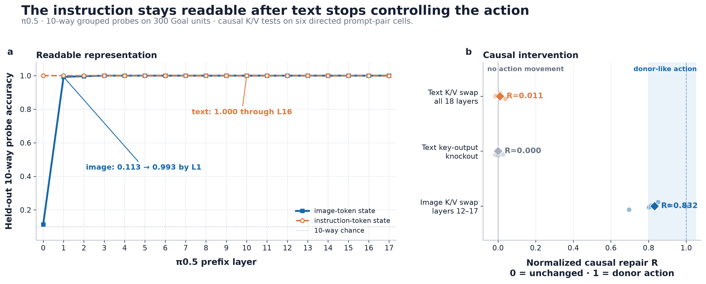

# Where does π0.5 keep the instruction it is following?

A causal interpretability study of instruction routing in the **π0.5 vision-language-action model**, evaluated on LIBERO Goal and Object manipulation tasks.

> **Main result:** Instruction identity remains essentially perfectly readable at the original text positions after those positions become almost causally irrelevant to the action. The action-relevant difference instead depends on broad, late image-associated state that can redirect complete robot rollouts—but resisted every compact approximation we tested.



## Results

| Finding | Evidence |
|---|---:|
| Readable text is not causally controlling text | 10-way text probe: `1.000` through L16; all-layer text K/V swap: `R=0.0106` |
| Late image-associated state controls action | Image K/V swap at L12–17: `R=0.8321` |
| The state controls complete behavior | Live late repair: `18/20` successes; early L0–5 control: `0/20` |
| The causal carrier is broad | 256 selected image positions: `R=0.082`; all 512: `R=0.773` |
| Broad control is not a clean policy switch | New screen: repair `9/10`, clean `10/10`; one wrong-first contact; median `+15` steps |

`R` is progress along the clean receiving-action → donor-action axis: `0` means the edit did not move the action; `1` reaches the donor action. It is not full-vector similarity.

## The intervention

Within each comparison, the camera image, robot state, and action noise were fixed; only the instruction changed. At every replan, the successful intervention replaced all 512 image-position keys and values at prefix layers 12–17 with state computed from the same observation under the correct instruction. It copied no donor action or stored trajectory.


The conflicting prompt makes the robot touch tomato sauce and fail. The same external prompt plus late-state repair makes it touch cream cheese and complete the task. The equal-size early-layer intervention does not.

## Why the result is not a compact instruction circuit

Object-local patches, static directions, low-rank subspaces, donor-free operators, and compact writer rescues all failed their stronger causal endpoints. The clearest dose test found little target-relevant movement until every image position was replaced:


The full instruction-dependent update across layers 6–8 did transfer partly between initial scenes and depended strongly on the MLP sublayers (`R=0.340` full versus `0.040` attention-only). But it redirected first contact in only `3/12` simulator cases and completed the target task in `0/12`. We therefore interpret it as local causal leverage, not policy transfer.

## Experimental setup

- **Primary model:** `lerobot/pi05_libero_finetuned_v044`, revision `8e174154ef5f6c60a8da12ae99c303d8963138c1`.
- **Tasks:** LIBERO Goal and Object simulated manipulation.
- **Counterfactuals:** identical observation, proprioception, and action-noise rule; paired valid instructions.
- **Measurements:** grouped linear-probe accuracy, normalized next-action geometry, first object touched, and simulator task success.
- **Architecture control:** OpenVLA-OFT, where the dominant direct route remained text-associated rather than image-associated.

## Evidence and methods

- [Research Direction](Research%20Direction.md) — full experiment lineage, 21 experiment families, methods, limitations, and prior work.
- [Numbers audit](numbers%20audit.md) — independently recomputed values, row counts, corrections, and hashes.
- [Figure guide](figures/README.md) — exact metrics and adjacent plotted-data CSVs.
- [Provenance](PROVENANCE.md) and [public archive boundary](PUBLIC-ARCHIVE.md) — what is preserved locally versus published here.
- [Prefill mediation](docs/FINDINGS-pi05-prefill-instruction-mediation-2026-08-31.md) — evidence that language is used before causal control leaves the text route.
- [Closed-loop state repair](docs/FINDINGS-pi05-mechanism-guided-instruction-repair-2026-08-31.md) — the canonical `18/20` behavioral result.
- [Side-effect screen](docs/FINDINGS-pi05-state-repair-side-effects-2026-09-04.md) — preservation and unintended-contact results.

The synchronized [GIF](media/videos/state-confirmation/combined.gif), [MP4](media/videos/state-confirmation/combined.mp4), and [WebM](media/videos/state-confirmation/combined.webm) show the four representative trajectories above.

## Verify this public snapshot

```bash
sha256sum -c PUBLIC-SHA256SUMS
```

Large activation arrays, model weights, historical raw tables, private application notes, and unrelated robotics-performance steering work are intentionally excluded. The complete local evidence archive is described in [PROVENANCE.md](PROVENANCE.md) and [SOURCE-MANIFEST.md](SOURCE-MANIFEST.md).

## Scope

This is one checkpoint on paired LIBERO tasks, not a universal claim about VLAs. The strongest intervention is donor-assisted, scene-conditioned, and broad. The project identifies a monitoring failure—**decodability can persist at a semantically obvious site after causal control has moved elsewhere**—but does not recover a small, portable instruction circuit or a deployable correction method.
