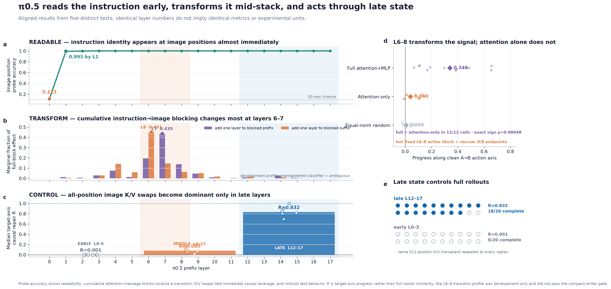
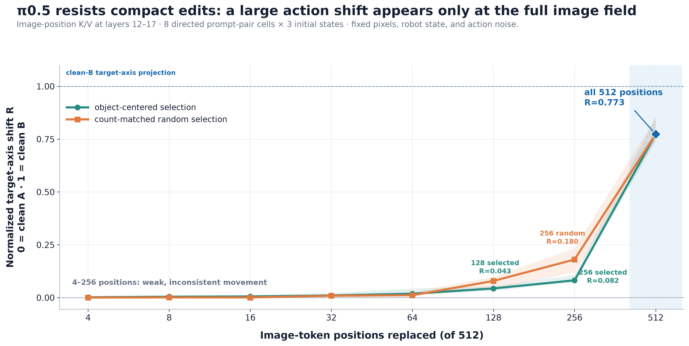

# Research Direction

**Date:** 2026-09-04  
**Status:** consolidated, evidence-checked research map—not an application draft  
**Numerical authority:** [`numbers audit.md`](numbers%20audit.md)  
**Machine-readable values:** [`artifacts/numbers-audit-derived.json`](artifacts/numbers-audit-derived.json)  
**Evidence boundary:** this document treats the MATS folder as the primary archive. Othello-style safety work, COAST, Cosmos, and robotics-performance steering in `../mechinterp-vla` are historical context only and are explicitly labeled when mentioned.

## The three application questions

### What question did you try to answer?

When a vision-language-action model turns an instruction and a camera view into a robot movement, **where does the instruction's causal influence go, and is there a small internal object we can edit to change only that decision?** Concretely, we tested whether π0.5 keeps a portable instruction direction, token-local code, low-rank subspace, or compact communication pathway—or whether action control is carried by a broad state that depends on the current scene.

### Why is this question interesting, and why did you choose it?

Interpretability methods are often validated on language-model outputs, where researchers can name a concept in words and search for it at token positions. A robot policy has to fuse language with pixels, robot pose, and motor constraints before acting. Its important decision may therefore live in a private, continuous coordinate system that does not line up with the words humans supplied. That makes the problem harder, but also gives unusually objective tests: hold the observation fixed, change the command, intervene internally, and measure the resulting action, first object touched, and task success.

The project began with the same concern in a JEPA-style world model: could a learned false physical rule be found and edited in latent space? That v0 organism never satisfied the behavioral preconditions for a causal interpretability study. π0.5 and LIBERO did. The pivot preserved the scientific question—how a model-internal physical decision is represented and used—while replacing an unfinished model-training project with a released policy, paired counterfactual stimuli, and observable behavior.

### What conclusions have you reached about this research problem?

π0.5 uses the instruction during multimodal prefill, but the readable copy left at text positions later has little causal control over the tested Goal actions. The instruction's consequence becomes part of broad image-position state. Replacing the entire late state can redirect full closed-loop behavior (`18/20` successes versus `0/20` for the early-layer control), so the handoff is real and behaviorally important. A preregistered follow-up on ten new task/state units found that the same late repair was powerful but not perfectly clean: `9/10` successes versus `10/10` clean, with one wrong-first-contact episode, one separate failure, and a median paired increase of `15` steps. Every completed attempt to compress the effect into a static direction, small image region, low-rank component, or compact writer failed its stronger causal endpoint. A final within-prompt-pair test isolated a **broad layer-6→8 transformation** that transferred between initial scenes and depended strongly on MLP processing. In a 36-episode simulator screen, that edit changed the first target toward B in `3/12` prompt pairs but completed B in `0/12`; clean B completed `12/12`. The honest conclusion is model-biological: **decodability, local causal leverage, selective intervention, and coherent behavioral control come apart after modalities mix.**

## The short version

The original hope was that a robot policy would contain a clean internal variable for “which instruction should I follow”—something like the single refusal direction found in language models. The experiments found a messier biology.

In the tested π0.5 policy, language matters when the model first processes the instruction and image together. After that, a readable copy of the instruction remains at the text tokens, but editing that copy barely changes the next action. The instruction's consequence has become embedded in a broad state attached to image positions and the current motor plan. Replacing the full late state can redirect complete rollouts, but a new preservation screen found that repaired behavior was not always the same as clean behavior. Compact directions, small token sets, low-rank operators, and compact writers failed. The full instruction-dependent update across layers 6–8 transferred partially between new initial scenes within the same prompt pair, but in the simulator it redirected first contact in only `3/12` pairs and achieved `0/12` task success.

The best research claim is therefore not “we found the instruction circuit.” It is:

> **π0.5 preserves a readable instruction at text positions after those positions become largely redundant for action. Its action-relevant consequence is carried by broad image-associated state that can control full rollouts but does not guarantee a clean policy switch. A full layer-6→8 instruction update transfers partly across initial scenes and requires the MLP computation, but it only sometimes redirects initial contact and does not transfer the complete task policy.**

This is useful model biology because it separates three things that are often collapsed: where information entered, where it can be decoded, and where the state controlling behavior currently lives.



The panels deliberately align layer numbers while keeping the measurements separate. Probe accuracy shows that instruction identity reaches image positions by layer 1. Cumulative causal attention-message blocking changes most when layer 6 or 7 is added, which locates a transition but did not pass the compact-writer criterion. Immediate all-position image K/V swaps become dominant only at layers 12–17, and the same late transplant controls `18/20` full rollouts. Within layers 6–8, the natural attention+MLP update moves the immediate action much more than attention alone, yet a fixed L6–8 block-and-rescue mechanism fails `0/8` endpoints. Thus the figure is evidence for a staged, broad computation—not a claim that one layer contains the instruction.


## How many experiments did we actually run?

**Counting rule:** an experiment family is one separately executed scientific question with its own intervention or analysis target. Seeds, initial states, prompt directions, ablation conditions, and rollouts are repeated units inside an experiment, not separate experiments.

By that rule, **21 computational experiment families produced real measurements**: **20 in the main VLA investigation** and **one earlier world-model feasibility pilot**. This is not “21 successes.” One donor-free run stopped at `250/400` planned rows, one reader result is development-only, and the world-model pilot never reached its intended false-belief test. The substantive CAFT fine-tune is not counted because it never ran. The main completed raw-integrity table contains `71,246` JSONL records, before several earlier behavioral, monitor, and CAFT-screen records. The stopped oversized rollout panel's 12 partial rows and the three-row smoke test are preserved but excluded from that completed-experiment total.

The overall hypothesis, in plain English, was:

> **Does a robot policy keep a small, reusable internal signal for which instruction it will follow—and can we change the robot's behavior by editing only that signal?**

The answer was: **we found where broad causal control moves and one partly reusable full-field transformation, but not a small reusable signal.**

| # | Experiment family | Question in plain English | Finding | Status and primary evidence |
|---:|---|---|---|---|
| 1 | World-model v0 feasibility pilot | Can we first create a model with a known false physical belief, then locate that belief? | The predictor ranked the true expert last in `12/12` scenes, and proprioceptive reset repaired prediction, but the planner produced `0/120` elite inaction samples. The intended implanted-belief experiment was never reached. | Feasibility-only; described under [Origins](#origins-from-world-model-forensics-to-vla-model-biology) |
| 2 | Behavioral instruction-conflict assay | Can the same scene make instruction following an objectively measurable robot behavior? | In the selected LIBERO Object region, the model obeyed the conflicting command in `190/200` episodes (`0.950`), versus `131/800` (`0.16375`) outside it. | Complete; `artifacts/vla_arbitration/20260830-192300/libero_object/per_episode.jsonl` |
| 3 | Layerwise readability and causal localization | Where is instruction identity readable, and which stored state actually changes action? | Text-position task identity stayed essentially perfectly decodable; image-position accuracy rose from `0.113` at L0 to `0.993` at L1. Yet text K/V repair was only `0.0106`, while late image K/V repair was `0.8321`. | Complete; `artifacts/vla_stage2/20260830-094027/libero_goal_confirm/` |
| 4 | Prefill handoff | Is the instruction used while the multimodal prefix is built, or is text simply ignored? | Swapping the instruction before prefill exactly swapped the action. Restoring A text K/V afterward stayed B-like (`D_A=0.9879`), while restoring non-text state became A-like (`D_A=0.0506`). | Complete; `artifacts/pi05_prefill_mediation_2026-08-31/rows.jsonl` |
| 5 | Static direction steering | Can one correct-minus-conflict vector repair new rollouts? | No setting passed the two-task gate. One task reached `5/5` correct first touches at α=1 but `0/5` successes: it changed the first decision without restoring the task. | Complete negative pilot; `artifacts/pi05_instruction_repair_2026-08-31/` |
| 6 | Closed-loop live state repair | If we transplant the broad late state on every replan, does the robot actually complete the other task? | Late L12–17 image K/V repair produced `18/20` correct first touches and `18/20` successes; the equally broad early L0–5 control produced `0/20` and `0/20`. | Complete; `artifacts/pi05_instruction_repair_2026-08-31/state_confirm/episodes.jsonl` |
| 7 | Broad-carrier mediation controls | Is the whole-image transplant carrying a real intermediate state, or merely damaging the model? | The whole carrier was B-like in `10/12` directions (`D_B=0.2349`); reset, dead-site, and random controls were B-like in `0/12`, and an unrelated donor in `1/12`. | Complete; `artifacts/pi05_mediation_2026-08-31/run2/rows.jsonl` |
| 8 | Object-local and position-dose test | Is the causal state concentrated at the named object or a small set of image positions? | Object-local replacement worked in `0/8` eligible directions. Replacing 4–256 positions barely moved action; the large effect appeared only at all 512 positions, and selected positions did not reliably beat random ones. | Complete; `artifacts/pi05_mediation_2026-08-31/dose1/rows.jsonl` |
| 9 | Activation monitor | Can a classifier trained on internal state detect obedience in new situations? | Development F1 was `0.9093`, but held-instruction F1 fell to `0.6810` and held-scene F1 to `0.7454`, both below the `0.8006` always-positive baseline. | Complete negative; `artifacts/pi05_monitor/monitor_cost.json` |
| 10 | CAFT-target viability screen | Does the region supply a shared low-rank direction worth ablating during fine-tuning? | The DiD-derived overlap was at or below the permutation null in all `36/36` layer/site/rank cells. That candidate was not a viable CAFT target. | Complete screen; `docs/FINDINGS-2026-08-31-night3.md` |
| 11 | Cross-model OpenVLA-OFT test | Is π0.5's image-associated route a general VLA mechanism? | No. In the equal-token panel, text K/V patching nearly reached the donor (`D_src=0.0101`), while image K/V patching did not (`D_src=0.9574`). | Complete boundary test; `artifacts/oft_downstream_kv/v2_20260831/rows.jsonl` |
| 12 | Sonar-lite low-rank geometry | Can a learned low-rank component extract the portable part of the broad state? | The selected L13 rank-16 component fit better than the wrong-prompt component in `12/12` cells, but insertion/removal reached the required endpoint in `0/12` joint directions. | Complete negative causal screen; `artifacts/pi05_sonar_lite_source_mediator_v1/` |
| 13 | Donor-free conditional repair | Can a learned rank-8 operator repair held-out edges without computing a live donor state? | On the three completed edges, repair succeeded `0/30`; correct and preserve controls succeeded `30/30`. The run stopped at `250/400` planned rows. | Paused negative; `artifacts/pi05_donor_free_repair_2026-09-02/confirm/episodes.jsonl` |
| 14 | Attention-writer block and rescue | Does direct instruction→image attention write the later action-controlling state, and can a small message restore it? | Blocking instruction→image communication made all `12/12` directions A-like. Restoring selected block-0 image messages did not rescue B. The route is necessary; the proposed compact seed is insufficient. | Complete screen; `artifacts/pi05_attention_pathway_2026-09-04_v1/writer_screen_rows.jsonl` |
| 15 | Image→action reader-size test | Can a small set of downstream layer/head edges read the image-associated state? | On development states, eight selected edges gave `10/12` joint endpoints and beat random controls, but no valid held-out prompt-pair confirmation was run. | Development-only; `artifacts/pi05_attention_resolution_2026-09-04_v1/reader_development_rows.jsonl` |
| 16 | Fixed layers-6–8 writer band | Did the apparent layers-6–8 transition identify a decisive reusable writer? | No: block and rescue reached `0/8` joint endpoints. Layer localization did not yield a sufficient mechanism. | Complete negative; `artifacts/pi05_writer_band_6_8_confirmation_2026-09-04_v3/rows.jsonl` |
| 17 | Midpoint representation-curvature test | Is the natural L6→8 transformation affine along the tested A/B path? | No. Median curvature/chord was `0.1880`, and all `12/12` direction medians exceeded `0.1`. This established path-specific non-affinity, not a nonlinear causal mechanism. | Complete diagnostic; `artifacts/pi05_lean_midpoint_curvature_2026-09-04_v1/rows.jsonl` |
| 18 | Curvature removal/rescue action test | Does that measured bend materially control the action? | It failed the frozen gate: median action change was `0.0973`, below `0.100`, and only `5/12` directions passed rather than the required `8/12`. | Complete negative follow-up; `artifacts/pi05_curvature_action_2026-09-04_v2/rows.jsonl` |
| 19 | Matched layer-6→8 transformation | Does the natural three-block instruction update transfer to another initial scene, and is attention alone sufficient? | A full message from another scene moved action `0.2108` along the A→B axis versus `0.0058` for random and beat random in `12/12` cells (`p=0.00049`). Matching full messages reached `0.3400`; matching attention-only reached `0.0402`, and full beat attention-only in `12/12` (`p=0.00049`). | Complete; `artifacts/pi05_matched_band_transform_2026-09-04_v1/rows.jsonl` |
| 20 | Matched-transform closed-loop breadth screen | Does that action-vector shift change what the simulated robot does? | The edit made B the first target in `3/12` prompt pairs versus `0/12` for clean A, but completed B in `0/12`; clean B completed `12/12`. This is initial redirection, not policy transfer. | Complete exploratory screen; `artifacts/pi05_matched_band_rollout_screen_2026-09-04_v1/episodes.jsonl` |
| 21 | Broad-repair side-effect screen | Does the successful late state transplant reproduce ordinary correct behavior without collateral contacts or inefficiency? | Live repair succeeded `9/10` versus clean `10/10`, with one wrong-first contact, one separate failure, no non-target grasps, and a median paired increase of `15` steps. Correct→correct transplantation was exactly inert; early and wrong-donor controls succeeded `0/10`. | Complete small preservation screen; `artifacts/pi05_state_repair_side_effects_2026-09-04_v1/episodes.jsonl` |

The substantive CAFT fine-tune is deliberately **not** added to this count because it was cancelled before it ran. Instrumentation checks are also not scientific experiments.

## Core questions

The investigation ultimately centered on five questions:

1. **When is language causally used?** Does the instruction matter only when the multimodal prefix is built, or do the text-token states keep driving action afterward?
2. **Where does the instruction's consequence go?** If later text-state edits do little, which internal state mediates the action difference?
3. **What kind of object is that state?** Is it a single direction, a low-rank subspace, a localized group of image patches, a compact attention pathway, or a broad conditional field?
4. **Does the internal result control behavior?** Can an intervention change the first object touched and complete a closed-loop robot task, rather than merely moving one action vector?
5. **Does the mechanism generalize?** Does it survive new scenes, new prompt pairs, matched controls, and a second VLA architecture?

The most important unresolved question is now sharper:

> Can the transferable part of the full layer-6→8 update be learned from calibration prompt pairs, compressed, and confirmed on genuinely new instructions and closed-loop behavior without collateral damage?

## Five most interesting findings, in plain English

### 1. The instruction matters early, then its readable text copy becomes mostly redundant

Changing only the instruction embeddings before π0.5 processes the multimodal prefix changed the action exactly. But after prefill, replacing the instruction-token K/V state barely changed the action: the median repair score was only `0.0106`. The model had not forgotten the instruction—the instruction remained almost perfectly linearly decodable through the final prefix layer. It had simply moved the action-relevant work elsewhere.

Plain English: the written order is still legible, but the machine is no longer taking commands from that piece of paper.

### 2. Broad image-associated state can control the robot's decision

Replacing image-position K/V across late layers 12–17 moved the immediate action strongly toward the donor instruction (`R=0.8321`). Repeating the same intervention at every replan repaired `18/20` conflicted rollouts, while an equally broad early-layer control repaired `0/20`. On ten new task/state units, late repair succeeded `9/10`, but one successful run touched the wrong object first, a different run failed, and repaired episodes took a median `15` more steps than their paired clean controls.

Plain English: the instruction's effect becomes part of a live scene-and-motor representation. Changing that representation can make the robot choose and complete the other task, but the broad transplant does not always reproduce the clean trajectory.

### 3. The useful state is not a small object patch or a reusable linear command

Patching the positions associated with the named object worked in `0/8` eligible directions. The median normalized target-axis shift was only `0.043` at 128 object-centered positions and `0.082` at 256. A count-matched random 256-position patch reached `0.180` but varied sharply between prompt pairs. Replacing all 512 positions produced the discontinuity: `0.773` along the clean A→B action axis. This axis score is not full-action similarity; the more conservative normalized distance to clean B remained `0.92599` at 256 selected positions and fell to `0.25636` only at all 512. A static correct-minus-conflict vector could make one task choose the right object `5/5` times and still complete it `0/5` times. A rank-16 Sonar-style component was more specific than all its controls but reached the desired endpoint in `0/12` joint directions.



Plain English: we could push the model in the right direction without actually restoring its computation. The successful whole-state transplant was carrying much more than a command label.

### 4. There is causal communication from instruction to image positions, but we did not isolate a compact writer

Blocking instruction-source attention messages into image receivers throughout the prefix made all `12/12` tested directions A-like. Blocking only the route into other non-image positions did not. Yet restoring all block-0 image-directed heads did not rescue the B action, and a later fixed layers-6–8 block-and-rescue test also failed.

Plain English: the direct language-to-image route matters, but the first message is not a little packet that can be put back to restore the behavior. The model may rewrite, transform, combine, or overwrite the signal across layers.

### 5. The useful layer-6→8 computation is more than attention, but its behavioral effect is incomplete

Holding the entering image state fixed, we measured the B-minus-A image update produced by layers 6–8 and added it to a clean-A host at layer 8. The matching-scene full update moved the action `0.3400` of the way toward clean B. A norm-matched full update from a different initial scene still moved it `0.2108`, versus `0.0058` for random; it beat random in all `12/12` prompt-pair cells. When the image-position MLP outputs in layers 6, 7, and 8 were clamped to their A values, the matching update moved action only `0.0402`. Full attention+MLP beat attention-only in all `12/12` cells.

In the simulator breadth screen, the same edit made B the first contacted target in `3/12` prompt pairs, compared with `0/12` for clean A, but it completed B in `0/12`; clean B completed `12/12`. The three-cell exact sign test was `p=0.25`, so this is exploratory evidence rather than confirmation.

Plain English: the model reuses something across camera states, but it is a large transformation of the mixed state, not a little attention message. That transformation can sometimes change the robot's initial target without supplying the continuing computation needed to perform the new task.


This does not erase the earlier warning: the Sonar and curvature results still show that attractive geometry can fail causal tests. The natural multi-block transformation passes the immediate-action comparison that compressed approximations failed, but the simulator result shows that even this broader success is not sufficient for policy transfer.

## What those findings add up to

The positive result is now a **causal handoff plus a partial transformation-level explanation**. Language enters through text, participates in prefill, and changes broad non-text state. The complete late-state transplant can control both immediate action and the full rollout. The smaller layer-6→8 update transfers across initial scenes within a prompt pair and is much stronger with the MLP computation than with attention alone, but its closed-loop effect stops at occasional initial target redirection.

The negative result is a **failure of compression**. We repeatedly tried to turn the handoff into a small, portable object:

- one additive direction;
- a localized object patch;
- a small subset of the 512 image positions;
- a fitted low-rank component;
- a donor-free conditional low-rank operator;
- a compact block-0 writer;
- a fixed layers-6–8 writer band;
- a simple nonlinear bend whose removal materially changes action.

None of the compact versions passed its frozen causal criterion. The successful layer-6→8 follow-up deliberately retained the whole 512-position message; it identifies the scale and within-block computation needed for transfer rather than solving compression.

The simplest current model is therefore:

```text
instruction + current scene + robot state
                  ↓
     multimodal prefill computation
                  ↓
broad image-associated scene/motor state
                  ↓
       distributed action readout
                  ↓
             robot action
```

“Scene-conditioned” now needs qualification. A full message from another initial state retained substantial action effect, so the transformation is not wholly scene-bound. Matching-scene messages were still somewhat stronger: median matched-minus-mismatched progress was `0.0584`, with 9/12 positive cell signs. The bootstrap interval excluded zero (`0.0049` to `0.1874`), but the exact sign test did not (`p=0.146`). The evidence therefore supports a shared cross-scene component plus scene-specific modulation, not total remapping or total invariance.

### Why might all the compact versions fail?

Three explanations fit the evidence and should be distinguished in future work:

1. **The useful subspace may rotate or be weighted differently by scene.** A rank-16 average can retain a small, correctly signed common component while losing the conditional directions that are strong enough to determine each action. In probabilistic language, the activation distribution and covariance within the fitted subspace may differ by scene and instruction; one global projection then treats unlike local geometries as if they were the same.
2. **The computation occurs inside and across transformer blocks.** A reported “layer” contains attention, residual addition, normalization, and an MLP. Attention can move language information into an image position; the MLP can nonlinearly reshape the mixed state there; later attention can mix it again. The new ablation confirms that this distinction matters: the matching attention-only update produced `0.0402` action-axis progress, while the full update produced `0.3400`, and full won in all `12/12` cells.
3. **Small transplants may create hybrid states.** Restoring one head or subspace from instruction B into an otherwise A-derived internal state can produce a combination the model never naturally visits. The transplanted component may be causal in its native context yet insufficient or actively cancelled in the mismatched context.

These are hypotheses, not post-hoc findings. A discriminating test would fit a scene-conditioned map for the natural layer-6→8 update, hold out entire prompt pairs, and compare matched attention-plus-MLP transplants with deliberately mismatched-scene transplants. Another rank sweep would not separate the explanations.

## Origins: from world-model forensics to VLA model biology

The repository history records the pivot rather than reconstructing it from memory:

| Commit | What changed | Scientific meaning |
|---|---|---|
| `1e080c1` | *Initial research scaffold for JEPA-WM causal forensics* | Began with an implanted false-physics rule in a JEPA-style MetaWorld predictor. |
| `ca3b272` | *Pivot to VLA instruction-locus interpretability* | Moved to π0.5 and OpenVLA-OFT after the world-model organism failed its behavioral preconditions. |
| `32285db` | *Rewrite README for a reader with no context* | Reframed the work around an observable instruction-conflict assay and causal interventions. |
| `2bfafb9` | *Qualify the attention dissociation by suite* | Narrowed an overgeneral claim after checking Goal and Object suites separately. |
| `179845a` | *Add latest VLA safety research workspace* | Added later local work; it is not part of the scoped MATS evidence and is kept separate here. |

The Othello lesson behind both versions of the project was about **coordinates**, not about copying an Othello circuit. In Othello-GPT, a human description such as black-versus-white can obscure a simpler model-relative variable such as mine-versus-theirs. A physical model has an even harder coordinate problem: the useful variable might be camera-relative, gripper-relative, goal-relative, or jointly conditioned on all three. A direction that looks stable in our chosen basis can rotate, split, or become curved across scenes without the underlying computation disappearing.

The three supplied conceptual diagrams summarize that lineage. `othello.png` motivates the move from human labels to model-native coordinates and from probing to intervention. `mech interp wm.png` shows why the causal chain is longer in a VLA than in a text-only model: image and language are fused, a planning state is formed, and an action expert reads it. `representational geometry + superposition.png` motivates the sequence of hypotheses we actually tested—direction, subspace, population code, and nonlinear geometry. These diagrams are conceptual maps, not experimental evidence.

### The v0 world-model question

The original project was about **false world-model beliefs** rather than instruction routing. The proposed organism was a JEPA-style MetaWorld predictor trained on a deliberately corrupted rule: a visibly locked door would open when pulled. The question was whether a narrow fine-tune could implant that false transition rule and whether model-diffing, probing, projection, and activation patching could identify where the rule lived.

That question came from a broader safety interest: models increasingly act in internal state spaces that humans cannot read directly. A language model can at least explain itself in words, even if those explanations are unfaithful. A world model or robot policy may express its “belief” only as a predicted future or physical action. If it learns a bad rule, the failure can remain latent until a particular scene activates it.

The v0 experiment was abandoned because the scientific preconditions were not met within the roughly 20-hour project budget. No validated fine-tuned implant checkpoint existed locally; the only detector result was a deliberately fake test; the proposed holdout construction did not align the necessary paired seeds; the intermediate lock-angle counterfactuals were not implemented; and the documented learning rate disagreed with the default run script. There was a real positive-control observation—the predictor ranked the true expert last in `12/12` bin-picking scenes and proprioceptive reset repaired it—but the planner did not exploit that failure (`0/120` elite inaction samples). Continuing would have meant debugging a training and data-generation program before reaching interpretability.

The pivot was practical and epistemic: use a released, capable VLA and a controlled simulator where language, image, robot state, action, first contact, and task success were all observable. That made it possible to ask a causal model-biology question within the time limit.

## How the investigation evolved

### Phase 1: find an objective behavioral conflict

The first useful assay held the LIBERO scene fixed and gave the policy a valid instruction that conflicted with the benchmark task. This produced a striking behavioral regime in `libero_object`: obedience was `0.950` inside a ten-cell scene/task region and `0.16375` outside it. The result made instruction following an objective physical question: which object did the robot touch first?

### Phase 2: localize readable and causal information

Layerwise probes and patching then produced the central mismatch. Instruction identity remained decodable in the text residual stream, and text tokens received high attention per token, yet post-prefill instruction K/V and key-output interventions had almost no action effect. Broad image K/V at layers 12–17 had a large effect.

This was the point where the project stopped being “which layer matters?” and became “how can readable information remain in one place while causal control has moved elsewhere?”

### Phase 3: test when the handoff happens

The prefill experiment intervened before and after construction of the prefix cache. Swapping instruction input embeddings exactly changed the action to the donor, while restoring destination instruction K/V did not undo it. Restoring non-instruction state did. Restoring all image state alone recovered much of the destination action.

This established that the instruction is genuinely used during prefill. It corrected an earlier, sloppy interpretation that the instruction positions were simply inert.

### Phase 4: demand behavioral validation

The live state-conditioned repair computed a correct-prompt donor on the same current observation at every replan, then inserted only late image K/V into the conflicted run. It recovered `18/20` task successes, while the early-layer control recovered `0/20`.


These are real simulator recaptures of Object task 1, initial state 20. The conflicting tomato-sauce prompt failed; the clean cream-cheese prompt succeeded; and the late L12–17 repair made the robot touch cream cheese and succeed despite the external tomato-sauce prompt. The early L0–5 control still touched tomato sauce and failed. All four outcomes match the archived records. The full synchronized animation is available as [GIF](media/videos/state-confirmation/combined.gif), [MP4](media/videos/state-confirmation/combined.mp4), and [WebM](media/videos/state-confirmation/combined.webm). It illustrates the original canonical confirmation, not the newer side-effect screen, which did not record video.

This was the strongest positive result, but also exposed the main limitation: all 512 image positions across six layers were replaced. That is causal leverage over a state, not an isolated instruction feature.

### Phase 5: try to compress the state

Object-local patches, position-count dose curves, static directions, Sonar-style subspaces, and a donor-free conditional operator all failed. These were not redundant failures. Together they ruled out increasingly flexible versions of the same appealing story: that the whole-state effect contains a small portable command variable that can be extracted and replayed.

### Phase 6: intervene on communication rather than stored state

Attention-edge block-and-rescue tested the proposed writer and reader. The instruction-to-image route across the prefix was necessary. A distributed late image-to-action reader looked selectively causal on development scenes. But neither the block-0 writer nor a fixed layers-6–8 writer band could rescue the instruction's effect, and the reader never received a valid held-out prompt-pair confirmation.

### Phase 7: test the nonlinear explanation directly

Because linear and low-rank edits kept failing, a lean midpoint-curvature test asked whether layers 6–8 were affine along the A/B interpolation. They were not: median curvature/chord was `0.1880`, with every direction median above `0.1`. The preregistered follow-up then asked whether removing that bend materially changed the action. It failed narrowly but clearly under the frozen gate.

The correct conclusion is not “we found the nonlinear manifold.” It is “one synthetic path bends, but the measured bend was not a confirmed action bottleneck.”

### Phase 8: test the natural multi-block transformation

The final test stopped trying to isolate one layer output or one geometric feature. It held the entering image field fixed at layer 5, ran layers 6–8 under instructions A and B, and treated their layer-8 image-field difference as the instruction-induced transformation. Adding the matching full transformation to a clean-A host moved the action `0.3400` toward B. A norm-matched transformation measured in another initial scene still moved it `0.2108`, far above the `0.0058` random control and better in all `12/12` cells.

Clamping the image-position MLP outputs in layers 6, 7, and 8 to their clean-A values reduced matching-scene progress to `0.0402`. The full transformation beat this attention-only ablation in all `12/12` cells. This is the first positive evidence that the relevant unit is a multi-block transformation rather than a single attention message. At this stage it remained broad, paired-run-derived, immediate-action-only, and untested on held-out prompt semantics; Phase 9 tested its behavioral consequence.

### Phase 9: ask whether the action shift survives contact with the simulator

The first rollout plan—five conditions, 12 prompt pairs, and five initial states—would have required 300 episodes and roughly two hours. That was excessive for the first question, so it was stopped after 12 preserved rows and replaced by a frozen breadth screen: one untouched initial state for all 12 pairs under clean A, clean B, and the full edit.

The edit made B the first contacted target in `3/12` pairs, compared with `0/12` under clean A. But it completed B in `0/12`, while clean B completed `12/12`. This resolves the ambiguity in the immediate-action result: the transformation has real but incomplete behavioral leverage. It can sometimes redirect the beginning of a trajectory without generating the sequence of state-dependent decisions required to finish the task.

### Phase 10: test whether the successful broad repair has side effects

The earlier `18/20` late-state repair established behavioral control, but success alone could hide detours or collateral contacts. A frozen 50-episode panel compared ten paired clean and late-repaired rollouts while adding exact correct→correct preservation, early-layer, and wrong-donor controls. Late repair succeeded `9/10`; one successful rollout touched the wrong object first, another rollout failed, and repaired episodes were longer in `8/10` pairs. The result preserves the causal claim while rejecting the stronger idea that the broad transplant is an ordinary, selective policy switch.

## Why VLAs rather than another LLM project

The personal motivation was not that VLAs are inherently safer or more intelligent than LLMs. It was that they make causal questions unusually concrete.

For an LLM, a behavior such as refusal, persona, honesty, or reasoning style is expressed in semantically rich language. That richness is scientifically useful, but evaluation can become ambiguous: did the model change its belief, its style, its willingness to answer, or just its wording? A VLA is closer to a planner/controller. It must turn a command and observation into a motor trajectory. In LIBERO, “what did the representation cause?” can be checked by the first object touched and whether the task completed.

This planner/persona contrast should not be overstated. VLAs contain language backbones and semantic knowledge; LLMs also plan; neither architecture has a clean essence. The useful distinction is operational: our VLA's output is a grounded action sequence with an external success condition, while an LLM's output is another linguistic object.

That is why VLA model biology is attractive. It connects internal representations to consequences in the world. The same fact raises the stakes: as learned policies control robots and vehicles, “the model usually responds correctly” is not enough. We need to know which internal signals actually govern action, whether they generalize, and whether interventions create downstream damage.

## Latent space, in ordinary language

A model's **latent space** is the collection of internal numerical states it uses between input and output. A camera frame, a sentence, a robot joint configuration, and an intended movement are converted into long vectors. The dimensions usually do not correspond one-for-one to human concepts. Meaning is encoded in locations, directions, curves, clusters, and interactions among these vectors.

Saying that a model “acts in latent space” means that its important decisions are made through these internal numbers before they become a visible action. In a world model, a future may be predicted as latent features rather than pixels. In a VLA, the command and scene may be fused into a state from which motor actions are decoded. The latent state can therefore contain a decision that is not cleanly readable from the original text tokens.

This is an important future direction for applied interpretability because the latent representation is where a learned controller can silently combine instruction, perception, prior behavior, and motor constraints. A monitor attached to the wrong copy of the information may confidently read the instruction without seeing the state that actually controls motion.

## Plato's cave and the original world-model interest

[Beyond Language Modeling](https://arxiv.org/abs/2603.03276), by Shengbang Tong, David Fan, Saining Xie and collaborators, uses Plato's cave as an analogy: text is a human-created, lossy description of reality—the shadows—rather than direct access to the objects and physics that cast them. The paper studies from-scratch multimodal pretraining and reports synergy between vision and language, emergent world-modeling behavior, modality specialization, and a much larger data appetite for vision.

That framing captures the original attraction of world models. If future systems learn from video, action, and physical interaction rather than only descriptions, their important abstractions may be less linguistic and less aligned with the categories humans naturally inspect. Interpretability then has to follow the computation into visual, temporal, and motor state instead of expecting every important concept to have a readable verbal home.

Our result is a tiny case study of that problem, not evidence for the broad philosophical thesis. The instruction entered as language, yet the tested action depended later on a state indexed by image positions. That does not mean the model discovered physics, and “image-associated” does not mean purely visual. It means token provenance stopped being a reliable description of function after modalities mixed.

## GEN-1.5, pretraining, and an important trend to watch

Generalist's [GEN-1.5 release](https://generalistai.com/blog/gen-1.5) is relevant as company evidence, not peer-reviewed proof. Generalist reports that the model pretrained continuously for more than eight months, that held-out next-action error kept improving, and that the resulting model could perform simple short-horizon tasks from one demonstration with no gradient update (`59% ± 10%` mean success across ten tasks) or with ten gradient steps on five minutes of data (`83% ± 9%`).

The interesting hypothesis is that broad robotics pretraining may increasingly determine what a policy can infer and adapt to, while post-training supplies less of the capability than it often appears to. [π0.5](https://arxiv.org/abs/2504.16054) similarly emphasizes heterogeneous co-training across robots, semantic prediction, web data, vision, language, and actions.

We should not turn two releases into a law that “pretraining matters more for VLAs than for LLMs.” LLM capabilities also depend heavily on pretraining, and robot post-training remains essential. The narrower point is that if physical skills and in-context adaptation emerge from multimodal pretraining, audits focused only on the final fine-tuning stage will miss much of the learned machinery.

## The Minecraft/Sonar analogy

The Sonar intuition was like locating a hidden redstone circuit in Minecraft. You can walk through the world, ping regions, and learn that toggling a broad area changes a door. But that does not tell you whether you found the lever signal, the wiring, the piston, or a chunk of the entire machine copied from another world state.

Our broad late-image patch was like pasting a working section of the redstone build into the current scene: the door opens, so the region is causally sufficient in context. Sonar-lite tried to isolate the smaller signal running through that region. It found a direction that aligned better with the intended A/B difference than wrong and random controls, but replaying it did not make the machine reach the target state.

This is why isolating mechanisms in VLAs may be harder than in some LLM examples. The representation has to bind a command to a particular arrangement of objects, camera geometry, robot pose, action history, and denoising process. The same abstract task can require a different local movement in every scene. A portable “pick up the bowl” direction may be much less natural than a conditional transformation that maps the current scene into an appropriate motor plan.

The analogy is a guide, not a conclusion. Some VLA features are demonstrably sparse and steerable in prior work. Our experiments only show that this particular instruction-to-action difference did not compress under the tested methods.

## Why representational geometry matters

Applied interpretability for VLAs cannot rely only on naming neurons or layers. It must ask how examples are arranged in activation space and how downstream computation transforms that arrangement.

A linear direction is a powerful object: it can be measured with a dot product, removed by projection, added at inference time, compared across scenes, and used during training. The refusal-direction result in LLMs shows why researchers look for these objects. But linearity is an empirical claim, not a default law.

Superposition gives one reason. A model may represent more features than it has dimensions by overlapping them. Sparsity makes this possible because most features are inactive on most examples, allowing them to share representational capacity. The “V2 brain region” inspiration from Trenton Bricken's work should be stated more carefully: the relevant lineage is Anthropic's work on superposition, sparse feature dictionaries, and later circuit tracing—not evidence that a VLA literally has a visual-cortex-like V2 region.

The so-called linear representation hypothesis is best treated as a useful working assumption: concepts often correspond to directions or low-dimensional subspaces. It should not be attributed as a universal theorem of Anthropic's work. [Not All Language Model Features Are One-Dimensionally Linear](https://arxiv.org/abs/2405.14860) gives explicit multidimensional circular features and causal interventions in language models. Othello-GPT originally reported a nonlinear board representation. Even when individual features are linear, the computation that binds several features can be nonlinear and context-dependent.

Our results do not disprove linear representation. They show a stricter limitation: a linear displacement can be causally real yet insufficient for a temporally extended behavior. The layer-6→8 B−A update moved predicted actions and occasionally changed the first target, but it never completed B in the breadth screen. A direction may therefore describe one local relation in activation space without being a portable coordinate for the entire policy. The missing ingredient could be a changing direction at later replans, scene-conditioned computation, redundant routes, off-manifold effects, or all of these. The evidence does not distinguish them yet.

For our project, geometry mattered in two ways:

1. It prevented a causal whole-state transplant from being mislabeled a concept intervention.
2. It let us test progressively richer compression hypotheses—direction, subspace, conditional affine operator, attention edge set, and midpoint curvature.

The negative results point toward studying transformations and conditional readouts, but they do not establish a globally dense nonlinear manifold. CKA, Procrustes alignment, or nonlinear probes could describe representational change; none by itself would show which state drives action. Any geometric claim still needs intervention and rollout validation.

## Othello, residual-stream intervention, and what we actually did

[Othello-GPT](https://arxiv.org/abs/2210.13382) inspired the form of the question: does a sequence model internally represent the state of a world, and can changing that representation predictably change its output? We did **not** train or intervene on an Othello model. “Othello-style” in our notes means borrowing its progression from representation discovery to causal manipulation.

We did perform residual-stream interventions in π0.5, but they were not the final mechanism. In the Stage-2 Goal confirmation, replacing image-position residual state across all layers had a median repair score of `0.4838`, with very large variation across prompt directions. The cleaner results came from projected K/V interventions and later source-specific attention-message interventions.

A separate source-only safety branch in `../mechinterp-vla` instrumented prefix image, language, and expert residuals exactly and ran an Othello-style probe/steering screen. It did not find a validated safety coordinate. That branch is not evidence for the MATS causal-handoff claim and was deliberately not imported into this folder.

## The CAFT attempt

[Concept Ablation Fine-Tuning](https://arxiv.org/abs/2507.16795) was appealing because it uses internal concept directions during training to steer how an LLM generalizes out of distribution. We asked whether the same idea could be applied to a VLA.

What actually happened was narrower:

- a difference-in-differences region direction was tested as a possible CAFT target and was null across all 36 tested cells at ranks 2, 3, and 5 (`p` values from `0.652` to `1`);
- a hook landmine was found: ordinary forward hooks did not fire on the π0.5 training path;
- a monkey-patched implementation did fire, preserved identity bitwise, and propagated gradients in `12/12` checks;
- the substantive CAFT fine-tune was cancelled before a scientific result, partly because the candidate direction was poor and published evidence made the proposed small LoRA route unattractive.

Therefore, “we applied CAFT to VLAs” would be false. We evaluated a candidate representation and validated the plumbing required for a future port. The episode was useful mainly because it exposed the dependence of CAFT on first finding a real, portable concept direction—the very object this project failed to isolate.

## Models and checkpoints

| Role | Model/checkpoint | Frozen revision | What it was used for |
|---|---|---|---|
| Primary organism | `lerobot/pi05_libero_finetuned_v044` | `8e174154ef5f6c60a8da12ae99c303d8963138c1` | Behavioral conflicts, probes, residual/KV patching, prefill mediation, closed-loop repair, Sonar-lite, donor-free repair, attention pathways, nonlinear tests |
| Behavioral baseline | `lerobot/pi05_libero_base` | `a217bfd3b14673cf2ce597e69997ab21866438dd` | Stage-0 comparison with the LIBERO-fine-tuned policy |
| Cross-architecture boundary | `moojink/openvla-7b-oft-finetuned-libero-spatial-object-goal-10` | `638918f3d1c2e43a39a8a20772bdb8b91835e4b7` | Persistent downstream K/V comparison and equal-token controls |

π0.5 was treated as an 18-layer PaliGemma multimodal prefix plus an 18-layer Gemma action expert. The key tested prefix sites were instruction positions, 512 valid image positions, other text/state positions, residual streams, and projected K/V. The key action-side test read image K/V through selected action-expert attention heads. OpenVLA-OFT was treated as a fused 32-layer decoder and is not causally equivalent architecture.

All core π0.5 mechanism runs used float32. Within an A/B comparison, pixels, proprioceptive state, token layout where possible, action noise, and non-instruction input embeddings were held fixed.

## Datasets, tasks, and stimuli

### Benchmark and data

The experiments used the official LIBERO simulation benchmark, chiefly `libero_goal` and `libero_object`. The local dataset metadata records 1,693 episodes and 273,465 frames across the downloaded LeRobot collection; 454 episodes matched all ten Object tasks and 428 matched all ten Goal tasks when building the abandoned training branch. The causal experiments themselves primarily used official simulator initial states rather than training new policies.

No claim should pool Goal and Object as if they were one homogeneous dataset. The two suites displayed different instruction-conflict behavior and served different experimental roles:

- `libero_goal` supplied same-observation A/B action contrasts for localization, prefill, mediation, Sonar-lite, attention, and nonlinear tests;
- `libero_object` supplied unambiguous object-choice behavior and closed-loop repair, because the named object could be scored by first contact.

### Goal tasks

The ten official task families were:

1. open the middle drawer of the cabinet;
2. put the bowl on the stove;
3. put the wine bottle on top of the cabinet;
4. open the top drawer and put the bowl inside;
5. put the bowl on top of the cabinet;
6. push the plate to the front of the stove;
7. put the cream cheese in the bowl;
8. turn on the stove;
9. put the bowl on the plate;
10. put the wine bottle on the rack.

The main mechanistic panel used six unordered prompt pairs in both directions, giving 12 directed cells, on identical time-zero observations and robot states.

### Object tasks

The ten Object tasks asked the robot to pick up one of these objects and place it in a basket:

`alphabet soup`, `cream cheese`, `salad dressing`, `BBQ sauce`, `ketchup`, `tomato sauce`, `butter`, `milk`, `chocolate pudding`, and `orange juice`.

The state-conditioned closed-loop confirmation used tasks 1 and 2 in zero-based indexing—cream cheese and salad dressing—with untouched initial states. The later donor-free test used five frozen directed task edges, but only three completed.

### Stimulus construction

The most important stimulus was not a natural-language dataset split; it was a controlled counterfactual:

- keep camera pixels and robot state fixed;
- keep model noise fixed;
- provide valid instruction A or valid instruction B;
- require the two clean runs to produce separated actions;
- measure whether an intervention on the B run moves internal state and action toward clean A, or vice versa.

This design makes the instruction the only changing input within a cell. It does not by itself establish broad semantic generalization: most experiments changed instructions within a small set of LIBERO task templates.


The heat map reports the original 1,200-rollout behavioral screen. Each cell is one official task across 20 initial states; the quoted cream-cheese/tomato-sauce and salad-dressing/ketchup pairs are the two later closed-loop repair tasks.

## Methodology

### 1. Behavioral assay

We first ran correct, null, and conflicting prompts through closed-loop LIBERO episodes. Outcomes were separated into obeying the supplied instruction, ignoring it in favor of the benchmark task, and jamming/doing neither. First object touched prevented “moving vaguely toward an object” from being counted as success.

### 2. Representation and attention measurement

We trained linear probes for instruction identity at text and image positions, examined layerwise attention under both per-token and total-mass normalization, and compared clean A/B activation geometry. These were discovery tools only.

### 3. Same-observation causal patching

For each A/B pair, we replaced selected activations from one clean run into the other. We tested residual states, K/V projections, instruction positions, image positions, early/middle/late layers, localized patches, and persistent downstream patches. Identity/self-patches had to be exact.

### 4. Prefill mediation

We changed instruction input embeddings before layer 0, then selectively restored instruction, non-instruction, image, or random-subset cache state. This distinguished “language was never used” from “language was used and its consequence moved.”

### 5. Causal mediation and dose tests

We inserted an early source instruction, transplanted the proposed image carrier, reset the intermediate state, and compared dead-site, random, unrelated, local, and cross-layout carriers. We varied image-position count from 4 to 512.

### 6. Closed-loop repair

At every replanning step, a correct-prompt donor and conflicted receiver saw the same live observation. Only late image K/V was copied into the receiver. The policy then generated fresh actions. Task success and first contact were scored prospectively.

### 7. Compact representation search

Sonar-lite fit low-rank paired token-by-feature components without using action outcomes for selection, froze layer 13/rank 16, and tested insertion/removal on new initial states against wrong-prompt, reverse-sign, and matched-spectrum random controls. The donor-free follow-up learned a conditional rank-8 affine operator from separate task edges and evaluated it during live rollouts.

### 8. Attention-edge block and rescue

Instead of replacing a whole layer state, we replaced source-position K/V inside attention, keeping receiver queries, masks, and non-source K/V unchanged. Writer tests targeted instruction→image communication across prefix layers. Reader tests targeted image→action messages in action-expert layers 12–17.

### 9. Lean nonlinear diagnostic

We interpolated between A/B states around layers 6–8, measured deviation of the midpoint output from the midpoint of endpoint outputs, verified endpoint identity, and then tested whether removing the observed bend caused a sufficiently large normalized action change. The second test was preregistered to stop the geometric observation from becoming a free-floating story.

### 10. Matched attention-plus-MLP transformation

We held the 512-position image field at layer 5 fixed to the A state, ran the layer-6→8 band under A and B, and inserted the resulting B-minus-A layer-8 update into a common clean-A host. The cross-scene arm used the next initial state's update and rescaled it to the matching update's Frobenius norm. The attention-only arm reran the band while clamping the image-position MLP output at each of layers 6–8 to clean A. This compares the natural full block computation with scene mismatch, attention-only, and equal-norm random controls without searching layers or doses.

### 11. Broad-repair preservation screen

We reran the successful late L12–17 transplant on new Object initial states and recorded contact order, non-target grasps, distinct objects touched, episode length, and end-effector path length. A correct-prompt host with a separately computed identical correct-prompt donor tested bitwise preservation; early-layer and valid wrong-object donors tested site and donor specificity.

### 12. Evaluation discipline

The project used discovery/development/confirmation splits where feasible, frozen gates, bidirectional A↔B tests, both distances to clean endpoints, exact identity checks, count- or norm-matched controls, prompt-length warnings, and stopping rules that kept protected confirmation closed after failed gates.

## Ablations and controls

| Family | What was removed, replaced, or restored | Main control/question |
|---|---|---|
| Text route | Instruction K/V at all prefix layers; instruction key output | Does readable text state still control action after prefill? |
| Image route | Image K/V at early 0–5, late 12–17, or all layers | Is the effect depth-specific? |
| Residual stream | Image residual state across layers | Is the effect specific to projected cache state? |
| Prefill | Instruction input swap, then restoration of instruction/non-instruction/image state | Was language used before becoming redundant? |
| Spatial localization | Named-object patches and 4/8/16/32/64/128/256/512 positions | Is the carrier localized or broad? |
| Carrier specificity | Dead layer, unrelated prompt, matched random positions, cross-layout donor | Is this content-specific or merely a large perturbation/state transplant? |
| Mediation reset | Reset the proposed mediator after the early instruction change | Is the late state on the causal path? |
| Static steering | Correct-minus-conflict vector at α = 0.5, 1, 2, 4 | Can one additive direction transfer across scenes and sustain a rollout? |
| Sonar-lite | Layers/ranks; wrong-prompt, reverse-sign, matched-spectrum random components | Does a specific low-rank component reach both causal endpoints? |
| Donor-free repair | Conditional rank-8 edit; early, random, orthogonal, wrong-instruction, preserve controls | Can an operator learned elsewhere repair held-out task edges without a live donor? |
| Writer communication | All instruction→non-instruction, instruction→image, instruction→other; selected/all-head rescue | Which outgoing instruction communication is necessary and sufficient? |
| Reader communication | Full late image block; selected 1/2/4/8/13-edge rescue; disjoint matched controls | How concentrated is the downstream image-to-action readout? |
| Writer band | Fixed layers 6–8 versus layers 14–16 control | Does the sharp transition profile identify a decisive writer band? |
| Nonlinearity | Endpoint identities, midpoint curvature, curvature removal/action rescue | Is non-affine geometry causally important to action? |
| Matched block transformation | Matching versus next-scene full update; MLP-clamped attention-only update; norm-matched random | Does the natural L6→8 computation transfer, and does within-token MLP processing matter? |
| Broad-repair preservation | Correct→correct identity, early band, wrong donor, paired clean trajectories | Does the successful broad edit preserve contact order and efficiency rather than merely reach the goal? |
| Cross-architecture | OpenVLA persistent image/instruction/both K/V plus residual controls | Is the π0.5 handoff architecture-general? |
| Monitoring | Random-fold development versus held-out instruction and held-out scene | Does an activation monitor generalize beyond the situations that made it look good? |

## Key metrics, results, and locations

This is the compact map. The exact definitions, hashes, and caveats are in [`numbers audit.md`](numbers%20audit.md).

| Result | Key number | Primary location |
|---|---:|---|
| Behavioral concentration | obedience `0.950` in region vs `0.16375` outside | `artifacts/vla_arbitration/20260830-192300/libero_object/per_episode.jsonl`; `artifacts/two_stage_cells.json` |
| Stage-2 localization | 60,000 raw rows; Goal confirmation 18,000 | `artifacts/vla_stage2/20260830-094027/` |
| Text decodability | `1.000` layers 0–16; `0.9987` layer 17 | `.../libero_goal_confirm/rows.jsonl` |
| Image-position decodability | `0.1133` L0 → `0.9927` L1 → `1.000` L4 | same |
| Post-prefill text causal effect | `KV[INSTR] R=0.01055`; `KO[INSTR] R=0.000073` | same |
| Late image causal effect | `KV[IMG]@12–17 R=0.83210` | same |
| Attention mismatch | text/image `11.41×` per token; image/text `4.99×` in total | same |
| Prefill handoff | 1,350 rows; all-image restore `D_dst=0.10498`; random subset `0.99843` | `artifacts/pi05_prefill_mediation_2026-08-31/rows.jsonl` |
| Closed-loop repair | live late repair `18/20`; early control `0/20`; conflict `0/20` | `artifacts/pi05_instruction_repair_2026-08-31/state_confirm/episodes.jsonl` |
| Repair side effects | late repair `9/10` vs clean `10/10`; wrong-first `1/10` vs `0/10`; no non-target grasps; median paired step increase `15`; exact preserve `10/10` | `artifacts/pi05_state_repair_side_effects_2026-09-04_v1/episodes.jsonl` |
| Mediation reset | broad carrier B-like `10/12`; reset `0/12`; dead/random `0/12` | `artifacts/pi05_mediation_2026-08-31/run2/rows.jsonl` |
| Position dose | target-axis shift `R`: object-centered 128 `0.043`; object-centered 256 `0.082`; random 256 `0.180`; all 512 `0.773`; normalized L2 `D_B`: object-centered 256 `0.92599`, all 512 `0.25636` | `artifacts/pi05_mediation_2026-08-31/dose1/rows.jsonl` |
| Sonar-lite | fit beats wrong `12/12`; joint target landings `0/12` | `artifacts/pi05_sonar_lite_source_mediator_v1/` |
| Donor-free | completed edges: repair `0/30`; correct/preserve `30/30`; run `250/400` | `artifacts/pi05_donor_free_repair_2026-09-02/confirm/episodes.jsonl` |
| Attention writer | full route block A-like `12/12`; block-0 rescue fails `12/12` | `artifacts/pi05_attention_pathway_2026-09-04_v1/writer_screen_rows.jsonl` |
| Reader development | 8 edges: removal A-like `0.833`; rescue B-like `1.000`; joint `10/12` | `artifacts/pi05_attention_resolution_2026-09-04_v1/reader_development_rows.jsonl` |
| Fixed writer band | block/rescue joint endpoints `0/8` | `artifacts/pi05_writer_band_6_8_confirmation_2026-09-04_v3/rows.jsonl` |
| Representation curvature | median `0.18797`; `12/12` direction medians ≥0.1 | `artifacts/pi05_lean_midpoint_curvature_2026-09-04_v1/rows.jsonl` |
| Curvature action test | median `0.09729`; `5/12` ≥0.1; preregistered fail | `artifacts/pi05_curvature_action_2026-09-04_v2/rows.jsonl` |
| Matched L6→8 transformation | matching full `0.33999`; other-scene full `0.21078`; random `0.00578`; attention-only `0.04022`; both key contrasts `12/12`, `p=0.000488` | `artifacts/pi05_matched_band_transform_2026-09-04_v1/rows.jsonl` |
| Matched-transform rollout screen | B first: edit `3/12`, clean A `0/12`, clean B `9/12`; task-B success: edit `0/12`, clean B `12/12`; exploratory B-first sign `p=0.25` | `artifacts/pi05_matched_band_rollout_screen_2026-09-04_v1/episodes.jsonl` |
| OpenVLA-OFT boundary | instruction `D_src=0.01005`; image `0.95743` | `artifacts/oft_downstream_kv/v2_20260831/rows.jsonl` |
| Monitor generalization | F1 dev `0.9093`; held instruction `0.6810`; held scene `0.7454`; baseline `0.8006` | `artifacts/pi05_monitor/monitor_cost.json` |

## Why some interventions improved one metric and harmed the task

An intervention can rotate the first action toward the desired clean action without restoring the sequence of computations needed for a multi-step task. That is exactly what the static-vector pilot showed: one condition chose the correct first object in `5/5` episodes but succeeded in `0/5`.

There are several plausible reasons:

- the edit imported the right initial subgoal but not a stable state the controller could update;
- the same direction also changed unrelated scene, pose, or motor features because they are superposed;
- the edit pushed activations off the states seen during training;
- the causal object is conditional on the current observation, so a fixed direction becomes stale as the rollout evolves;
- downstream layers compensated for, overwrote, or amplified the perturbation unpredictably.

This is why “steerability” needs multiple endpoints. For a physical policy, useful control should improve immediate action, first contact, complete success, preservation on already-correct runs, and ideally unrelated tasks. A change in one metric is evidence of causal leverage, not automatically improvement.

## Why steerability matters

Fine-tuning changes a vast number of coupled parameters. It can produce the desired average behavior while leaving unclear what rule the model learned, which situations activate it, and which capabilities were changed accidentally. This is true whether training uses supervised action targets, preference/reward signals, or another objective. “Reward hacking” is not the right label for every supervised fine-tuning failure; the broader problem is **objective misspecification and opaque generalization**.

Mechanistic interventions offer the possibility of finer control: identify the state responsible for a behavior, change it directly, and test collateral damage. In LLMs, a single-direction intervention can sometimes make this vision real. In VLAs, the physical stakes are higher because unwanted changes can become collisions, wrong-object grasps, or unsafe trajectories.

Our work is cautionary here. The broad state was highly steerable but not selective; the selective low-rank state was weak; the static edit produced the desired first touch without task completion. Steerability and understanding are related but distinct. A good applied-interpretability toolkit needs both control and evidence that the control acts through the intended computation.

## Why physical-AI interpretability matters now

Robotics is arguably less open than frontier language modeling in the places that matter for replication. Models depend on proprietary robot fleets, embodiment-specific data, calibration, control stacks, and expensive evaluation. Even “open” checkpoints may have incomplete training data or fragile environments. This makes independent mechanistic work harder and increases the value of inspectable, checkpoint-pinned assays.

The field is also moving toward learned world representations. Wayve's public [GAIA-4 description](https://wayve.ai/thinking/gaia-4/) presents a learned closed-loop world model for evaluating autonomous-driving policies. Separate work such as [Drive-JEPA](https://arxiv.org/abs/2601.22032) and [WA-JEPA](https://arxiv.org/abs/2608.20974) applies joint-embedding predictive ideas to driving and planning. We found no primary source showing that Wayve itself uses JEPA; the earlier wording conflated Wayve's GAIA line with separate JEPA-driving research.

The corrected strategic point remains: learned latent world models and end-to-end controllers are entering safety-relevant physical systems. Evaluation by aggregate success alone leaves a black box between sensor input and action. Applied interpretability should develop now, while open checkpoints and simulators still permit causal experiments.

## Top ten papers that shaped the project

These are the most direct conceptual influences, not a claim that every method was successfully reproduced.

1. [**π0.5: a Vision-Language-Action Model with Open-World Generalization**](https://arxiv.org/abs/2504.16054) — defined the primary organism and explains its heterogeneous multimodal co-training.
2. [**Emergent World Representations: Exploring a Sequence Model Trained on a Synthetic Task**](https://arxiv.org/abs/2210.13382) — Othello-GPT supplied the internal-world-state question and the demand for intervention after probing.
3. [**Refusal in Language Models Is Mediated by a Single Direction**](https://arxiv.org/abs/2406.11717) — supplied the appealing compact-direction standard: remove and add the representation, then measure behavioral specificity.
4. [**Not All Language Model Features Are One-Dimensionally Linear**](https://arxiv.org/abs/2405.14860) — warned that the relevant unit can be irreducibly multidimensional even in LLMs.
5. [**Toy Models of Superposition**](https://transformer-circuits.pub/2022/toy_model/) — motivated thinking about capacity, sparsity, overlapping features, and why one direction may mix several functions.
6. [**Steering Out-of-Distribution Generalization with Concept Ablation Fine-Tuning**](https://arxiv.org/abs/2507.16795) — motivated the abandoned attempt to use an internal VLA concept during fine-tuning rather than only at inference.
7. [**Mechanistic Interpretability for Steering Vision-Language-Action Models**](https://arxiv.org/abs/2509.00328) — establishes sparse semantic VLA directions and zero-shot steering, making it essential prior art and a contrast to our non-portable instruction effect.
8. [**VLA-Trace: Diagnosing Vision-Language-Action Models through Representation and Behavior Tracing**](https://arxiv.org/abs/2605.30117) — already combines CKA, attention knockout, and rollout behavior on π0.5 and OpenVLA; it sharply limits any novelty claim based only on layer/modality tracing.
9. [**Sparse Autoencoders Reveal Interpretable and Steerable Features in VLA Models**](https://arxiv.org/abs/2603.19183) — shows that some VLA features are sparse, general, and causally steerable, so our failures cannot support “VLA representations are never linear or sparse.”
10. [**Beyond Language Modeling: An Exploration of Multimodal Pretraining**](https://arxiv.org/abs/2603.03276) — connects multimodal pretraining, world modeling, modality specialization, and the Plato's-cave motivation.

Two especially relevant supporting papers are [Cross-modal Information Flow in Multimodal Large Language Models](https://arxiv.org/abs/2411.18620), which already studies how information migrates across modality-labeled positions, and [Causality ≠ Decodability, and Vice Versa](https://arxiv.org/abs/2510.09794), which independently demonstrates in vision transformers that late decodable tokens can be causally inert.

## Is this novel?

### What prior art already establishes

Prior work already establishes that:

- multimodal transformers move information between language and visual token positions;
- VLA models have layer- and modality-specific routing differences;
- VLA hidden states can contain sparse semantic and motor features that causally steer behavior;
- decodability and causal use can diverge;
- some model features are multidimensional rather than one-directional.

Therefore, “image tokens matter,” “layers 12–17 matter,” “attention differs by layer,” “VLA states are nonlinear,” or “probes do not prove causality” are not novel claims.

### The narrow contribution that may be new

The most defensible contribution is the combined empirical chain in this particular π0.5 setting:

1. an instruction-input prefill swap changes action exactly;
2. the final text-token state remains readable and highly attended but becomes largely redundant under post-prefill intervention;
3. broad late image-associated state mediates the difference and can repair complete conflicted rollouts;
4. targeted attempts to compress that state repeatedly fail, including local patches, static vectors, a held-out rank-16 component, a donor-free rank-8 operator, and compact writer rescues;
5. direct instruction→image communication across the prefix is necessary, while the exact writer remains unresolved;
6. a full layer-6→8 instruction-induced update transfers between initial scenes within a prompt pair, while clamping the three image-position MLP outputs removes most of its causal effect;
7. that edit sometimes changes the first target (`3/12`) but does not complete the new task (`0/12`), separating local steering from policy transfer;
8. the stronger whole-state transplant usually repairs the task but can still alter contact order, fail, or lengthen the trajectory, separating behavioral success from selective control;
9. a second architecture shows the opposite direct-route balance.

That is more specific than a generic layer map. It is evidence that **monitor location, causal state, compact representation, and transferable computation can come apart inside an embodied policy**. The negative compression ladder plus the positive full-transformation ablation is arguably the distinctive part.

The novelty remains bounded because the new transformation still spans all 512 image positions, is derived from paired A/B runs, and transfers only across initial states inside known prompt pairs. It now has exploratory closed-loop validation, but that validation is mostly negative: `3/12` B-first contacts and `0/12` task successes. A strong paper would need to learn the transformation on calibration prompt pairs, confirm it on genuinely new prompt semantics, compress or structurally explain it, and achieve task success with preservation controls.

## Limitations

1. **One primary checkpoint.** Most causal depth comes from one π0.5 LIBERO-fine-tuned revision. OpenVLA-OFT is a boundary condition, not a matched replication.
2. **Narrow task language.** LIBERO uses templated commands and a small set of manipulation tasks. This is not evidence about open-ended language understanding.
3. **Broad donor intervention.** The successful `18/20` repair copies all 512 image positions across six layers from a correct-prompt computation on the same observation. A ten-unit side-effect screen found `9/10` success, one wrong-first contact, one separate failure, and longer episodes in `8/10`; this is informative but too small to estimate rare harms.
4. **Incomplete portability test.** The donor-free run stopped at 250/400 rows; only three held-out edges completed.
5. **Reader not fully confirmed.** The 8-edge reader passed development initial states, but the original held-out prompt-pair panel was invalid and the corrected panel was never run.
6. **Writer only partly resolved.** The full layers-6–8 update is causal and the MLP ablation is strong, but this does not identify which MLP features, attention heads, or interactions compute the transferable component.
7. **Synthetic nonlinear path.** Midpoint interpolation may traverse states the model never naturally visits. Curvature there need not describe the natural activation manifold.
8. **Behavioral coverage.** The strong full-state repair measured two Object tasks. The layer-6→8 Goal breadth screen covered 12 directed pairs but only one initial state per pair, omitted random and attention-only rollout controls, and achieved no task-B successes.
9. **Narrow collateral-damage coverage.** The final preservation screen measured contacts, grasps, path length, and success on two Object tasks, but it was only ten paired units and did not test unrelated tasks, layouts, or collision classes.
10. **Archive boundary.** Large activation intermediates and unrelated safety/robotics branches are excluded, though raw rows, analyzers, manifests, and runtime snapshots for the core claims are retained.
11. **Restricted transformation generalization.** “Other scene” means a different LIBERO initial state for the same directed instruction pair. It is not held-out task language, a different suite, or another checkpoint.

## Errors and conceptual mistakes to avoid

- Do not call image-position state “vision” after multimodal attention has mixed language, robot state, and image information.
- Do not call perfect probe accuracy a mechanism.
- Do not call a full 512-position, six-layer state transplant a feature or direction.
- Do not use projected movement toward a target without reporting distance to both clean endpoints; off-manifold damage can look like progress.
- Do not call control-beating pressure a successful repair when it never crosses the endpoint midpoint.
- Do not infer a dense nonlinear manifold, dimension expansion, or “untangling” from one curvature or CKA statistic.
- Do not call new initial states within known prompt pairs semantic holdout.
- Do not generalize Goal results to Object or π0.5 results to all VLAs.
- Do not say CAFT was applied, Othello was run, or Wayve uses JEPA.
- Do not retroactively loosen `0.100` to make the `0.0973` curvature-action result pass.
- Do not call the route “repeated direct writing.” The block data establish necessity across the prefix; the failed rescues leave several mechanisms possible.
- Do not call the matched layer-6→8 message a compact or universal feature. It is a full 512-position paired-run difference that transfers across initial states within known prompt pairs.
- Do not call `3/12` B-first contacts a task repair. The same intervention achieved `0/12` task-B success, and the three nonzero cells give only `p=0.25` in the exploratory sign test.

## Future directions

### 1. Stop searching for another universal direction

The accumulated evidence makes another rank, layer, or direction sweep low value. A useful future experiment should test a different object: a conditional transformation or reader that depends on scene state.

### 2. Confirm or kill the reader on genuine prompt-pair holdout

The corrected eight-direction Object pair panel is frozen. Running the 1/2/4/8/13-edge reader comparison there would determine whether the development reader is reusable or another same-task geometric regularity. This is the cleanest unfinished confirmation, but it should not be sold as a route to acceptance unless it succeeds strongly.

### 3. Learn and compress the transferable layers-6–8 update

The final experiment shows that a full instruction-induced update measured in one initial scene transfers to another within the same prompt pair. The next step is no longer another layer sweep. Learn that update from calibration prompt pairs, predict it without a paired donor, and test it on entirely held-out prompt pairs. Then compress it by head, MLP feature, token group, or conditional low-rank operator while preserving the `12/12` directionality. Closed-loop success and unrelated-task preservation must be predeclared.

### 4. Distinguish rewrite, relay, and overwrite

Use causal scrubbing or path patching with natural source states to test whether instruction information is newly injected at later layers, transformed from existing image state, or routed through state/format positions. The unit of analysis may need to be a two- or three-layer computation, not one head.

### 5. Measure collateral damage explicitly

The ten-unit screen established the measurement pattern and found two direct deviations from clean behavior, but it is not a broad safety battery. Expand it prospectively to already-correct unrelated tasks, different layouts, action smoothness, collision rate, first touch, and complete success. Physical control that improves one benchmark while degrading neighboring behavior is not selective understanding.

### 6. Compare training regimes, not just architectures

π0.5 and OpenVLA-OFT differ in architecture, tokenization, objectives, and fine-tuning. A better comparison would use base and fine-tuned checkpoints within each family to ask whether pretraining or task adaptation creates the handoff and whether compactness changes with training.

### 7. Use sparse dictionaries carefully

VLA SAE work makes sparse feature search plausible. But the test should be conditional and behavioral: does an SAE feature or small feature set generalize across scenes, work in both insertion and ablation, preserve unrelated tasks, and improve full rollouts? Feature interpretability without those tests would repeat the probe problem.

### 8. Return to world models after the tooling is mature

The long-term question remains compelling: how can we audit a learned physical rule that is expressed only through predicted latent futures? A future JEPA/world-model project should begin with a released checkpoint, a naturally occurring error, a validated causal behavioral assay, and paired counterfactual data—before any circuit search or fine-tune.

## Why this work matters even though the compact mechanism failed

As physical AI scales, it will be tempting to reuse interpretability intuitions that worked on language models: find a concept direction, inspect the semantically named tokens, and steer. Sometimes that will work; prior VLA papers show real examples. Our experiments show a complementary failure mode.

The model can keep an instruction perfectly readable where a human expects it while the actionable version has become part of a broad control state. We can change that state and change the robot, and a full three-block update even transfers between initial scenes, yet we still fail to isolate a compact instruction variable. This is precisely the situation in which a superficially convincing monitor or one-vector steering method can provide false confidence.

The practical objective of VLA model biology is therefore not merely to label internal features. It is to build causal tools that tell us:

- which state is actually governing the next action;
- how that state was computed from language and perception;
- whether an intervention transfers to new scenes and commands;
- whether it preserves behavior we did not intend to change;
- and whether a mechanistic diagnosis predicts complete closed-loop outcomes.

That standard is harder than making a good activation plot. It is also the standard physical systems require.

## Current honest conclusion

The results are bad for the original compact-direction hypothesis and informative for a transformation-level model-biology story. We found a causal handoff, a behaviorally powerful downstream state, and a broad layer-6→8 instruction update that transfers across initial scenes within a prompt pair. The MLP-clamp ablation shows that attention-only routing explains little of its immediate-action effect. The rollout screen then showed one limit: `3/12` initial target redirections but `0/12` task completions. The side-effect screen showed another: even the stronger whole-state repair produced `9/10` successes rather than clean `10/10`, with one wrong-first contact and generally longer trajectories. We did not find a compact, donor-free representation or complete writer-reader circuit.

For a MATS application, this remains high-end borderline rather than a clean accept. The final experiments distinguish cross-scene transfer, attention routing, MLP transformation, immediate action, first contact, and complete task success with frozen tests. But the central positive object is broad and paired-run-derived; its closed-loop effect is incomplete and not confirmed on new prompt semantics. The application should lead with the surprising mechanistic update—**a locally effective linear displacement can redirect the start of behavior without transferring the policy**—and state the `0/12` success result without euphemism.

## Reproducibility map

- Numerical audit: [`numbers audit.md`](numbers%20audit.md)
- Audit script: [`scripts/audit_research_numbers.py`](scripts/audit_research_numbers.py)
- Provenance boundary: [`SOURCE-MANIFEST.md`](SOURCE-MANIFEST.md)
- Provenance audit: [`PROVENANCE.md`](PROVENANCE.md)
- Full application notes: [`MATS Application Writeup - Notes.md`](MATS%20Application%20Writeup%20-%20Notes.md)
- Canonical prefill findings: [`docs/FINDINGS-pi05-prefill-instruction-mediation-2026-08-31.md`](docs/FINDINGS-pi05-prefill-instruction-mediation-2026-08-31.md)
- Closed-loop repair findings: [`docs/FINDINGS-pi05-mechanism-guided-instruction-repair-2026-08-31.md`](docs/FINDINGS-pi05-mechanism-guided-instruction-repair-2026-08-31.md)
- Sonar-lite findings: [`docs/FINDINGS-pi05-sonar-lite-source-mediator-2026-09-04.md`](docs/FINDINGS-pi05-sonar-lite-source-mediator-2026-09-04.md)
- Attention-pathway findings: [`docs/FINDINGS-pi05-attention-pathway-block-rescue-2026-09-04.md`](docs/FINDINGS-pi05-attention-pathway-block-rescue-2026-09-04.md)
- Writer-band and nonlinear follow-ups: [`docs/FINDINGS-pi05-writer-band-and-nonlinear-followups-2026-09-04.md`](docs/FINDINGS-pi05-writer-band-and-nonlinear-followups-2026-09-04.md)
- Matched layer-6→8 transformation: [`docs/FINDINGS-pi05-matched-layer6-8-transform-2026-09-04.md`](docs/FINDINGS-pi05-matched-layer6-8-transform-2026-09-04.md)
- Matched-transform rollout screen: [`docs/FINDINGS-pi05-matched-layer6-8-closed-loop-2026-09-04.md`](docs/FINDINGS-pi05-matched-layer6-8-closed-loop-2026-09-04.md)
- Broad-repair side-effect screen: [`docs/FINDINGS-pi05-state-repair-side-effects-2026-09-04.md`](docs/FINDINGS-pi05-state-repair-side-effects-2026-09-04.md)
- Donor-free pause record: [`docs/PAUSE-pi05-donor-free-low-rank-repair-2026-09-04.md`](docs/PAUSE-pi05-donor-free-low-rank-repair-2026-09-04.md)
- Figure suite: [`figures/README.md`](figures/README.md)

The figures follow the principle in [Neel Nanda's paper-writing advice](https://www.alignmentforum.org/posts/eJGptPbbFPZGLpjsp/highly-opinionated-advice-on-how-to-write-ml-papers): each should communicate one claim, annotate the comparison that matters, and remain interpretable without reading a log dump.
