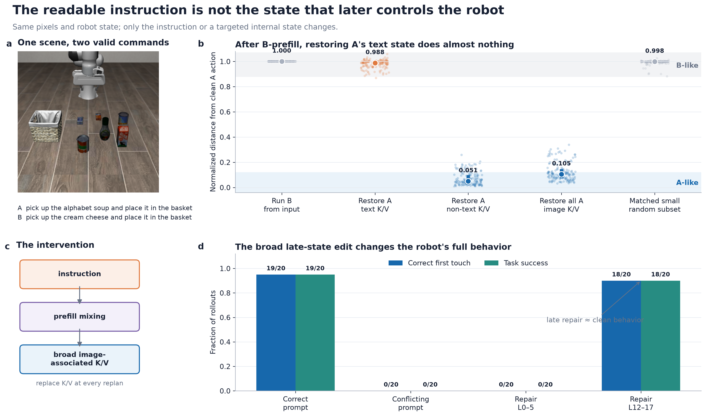
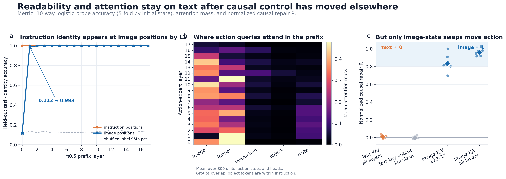
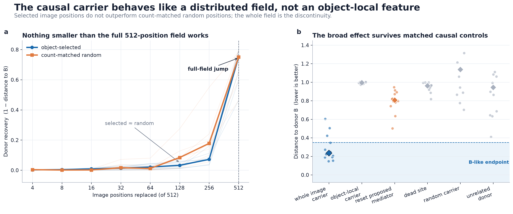
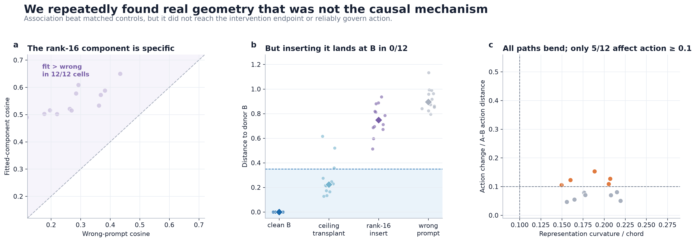
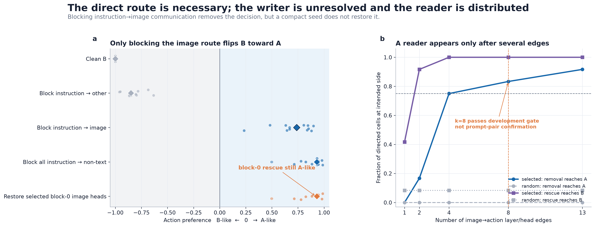
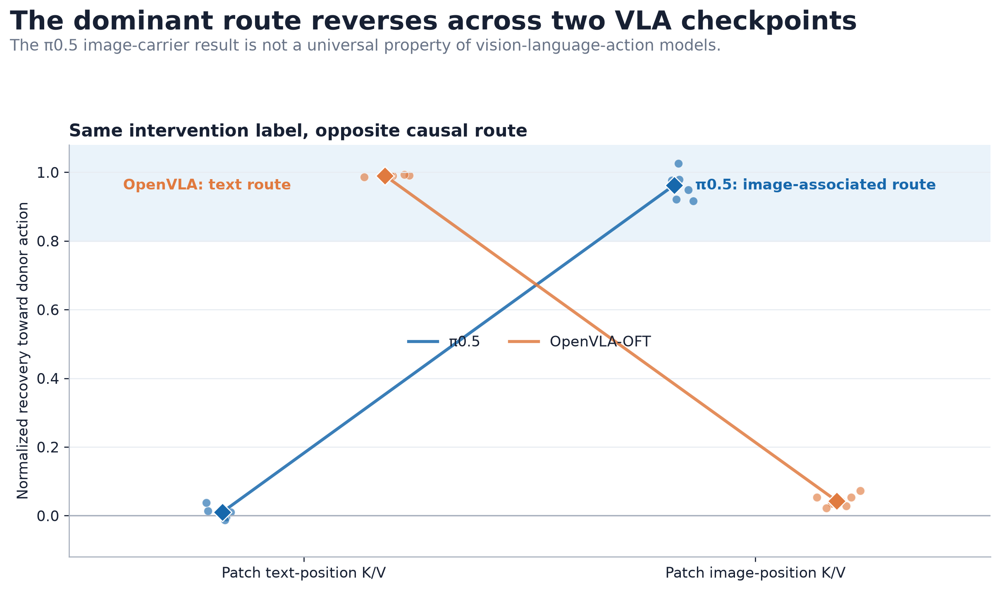
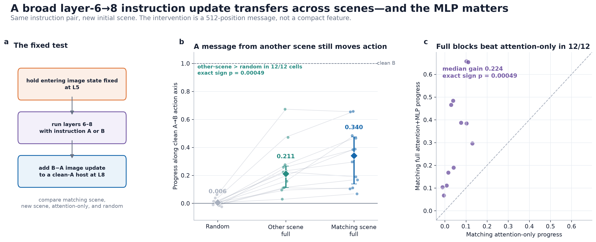
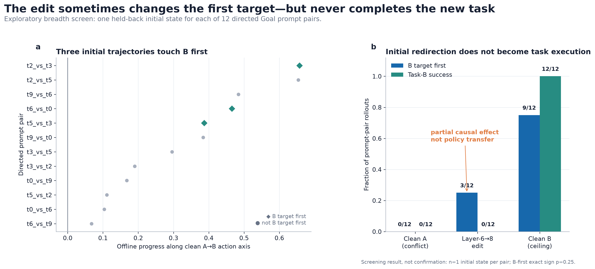

# Research figures

These figures are the evidence-facing visual summary for [`../Research Direction.md`](../Research%20Direction.md). They follow two examples supplied by the project owner: [Neel Nanda's figure advice](https://www.alignmentforum.org/posts/eJGptPbbFPZGLpjsp/highly-opinionated-advice-on-how-to-write-ml-papers) and the “Wait” application write-up. The operative design rule is: **show a concrete stimulus, expose the raw experimental units, name the metric, and make one scientific claim per figure.**

The PNG files are for Markdown and slides; PDFs are vector versions. Every quantitative panel has an adjacent CSV containing the exact plotted values. Old `01_summary_table` through `07_evidence_chain` files are superseded and should not be used in a paper or application.

## Key results at a glance

| Claim | Metric and unit | Result | Scope |
|---|---|---:|---|
| Instruction identity reaches image positions immediately | 10-way logistic-probe accuracy, 5-fold grouped by initial state | `0.113` at L0 → `0.993` at L1 | 300 Goal confirmation units |
| Readable text state is nearly causally redundant after prefill | normalized repair `R`, prompt-pair-direction median | text K/V `0.0106` | six directed confirmation values |
| Broad image-associated state controls immediate action | normalized repair `R`, prompt-pair-direction median | image K/V L12–17 `0.8321` | six directed confirmation values |
| Broad late-state repair controls full behavior | successes and correct first touches | late `18/20`; early control `0/20` | 80 closed-loop rollouts |
| Causal carrier is distributed over image positions | normalized donor recovery | little recovery through 256 positions; large jump at all 512 | eight directed cells × three initial states |
| Low-rank geometry is specific but not sufficient | cosine fit and endpoint distance | fit > wrong `12/12`; causal target `0/12` | 12 directed cells |
| L6–8 path is non-affine but not a confirmed action bottleneck | curvature/chord and normalized action change | curvature `0.1880`; action `0.0973`, `5/12` pass | 12 directed cells × five states |
| Full L6–8 update transfers across initial scenes and needs MLP processing | action-axis progress, prompt-pair-cell median | other-scene full `0.2108` vs random `0.0058`; full > attention-only `12/12` | 12 directed cells × five states |
| The L6–8 edit changes some initial choices but not task success | B-first contact and task-B completion | edit `3/12` B-first, `0/12` success; clean B `9/12`, `12/12` | exploratory screen, one state × 12 directed cells |
| Dominant route is architecture-dependent | normalized donor recovery | π0.5: image; OpenVLA-OFT: text | π0.5 six directions; OFT seven tasks |

## 1. Stimulus, intervention, and behavior



**What to notice:** the model receives the same LIBERO scene and robot state under two valid commands. After prefill, putting A's text K/V back into a B run leaves the action B-like, while restoring broad A non-text/image-associated state makes it A-like. Applying the late L12–17 image K/V transplant at every replan changes the first object touched and task success (`18/20`), whereas the early L0–5 control remains `0/20`.

**Stimuli:** official LIBERO scenes, identical time-zero pixels and proprioception within A/B comparisons; panel a shows `libero_object` task 0 with “pick up the alphabet soup…” versus “pick up the cream cheese…”. The mechanistic prefill panel uses three independent `libero_goal` prompt pairs, 25 initial states, and both directions (`150` independent units). The behavioral panel uses two Object task conflicts and initial states 20–29.

**Intervention:** source/destination instruction swap before prefill; then post-prefill restoration of selected destination K/V groups. Closed-loop repair replaces all 512 image-position K/V vectors at layers 12–17 with a same-observation, correct-prompt donor at every replan.

**Metric:** `D_to_A` is Euclidean next-action-chunk distance normalized by the clean A↔B distance (`0=A-like`, `1=B-like`). Closed-loop metrics are binary correct-first-touch and simulator task success.

**Data:** [`01b_prefill_units.csv`](01b_prefill_units.csv), [`01d_closed_loop.csv`](01d_closed_loop.csv); raw `../artifacts/pi05_prefill_mediation_2026-08-31/rows.jsonl` and `../artifacts/pi05_instruction_repair_2026-08-31/state_confirm/episodes.jsonl`.

## 2. Layerwise readability, attention, and causal effect



**What to notice:** there is no layerwise loss of instruction readability at the text positions. Text-position task identity remains essentially perfect, while image-position accuracy jumps from `0.113` at layer 0 to `0.993` at layer 1. Action queries continue to place visible attention mass on instruction tokens, but swapping text K/V has almost no causal effect; broad image-position K/V swaps do.

**Probe metric—not correlation:** multinomial logistic-regression accuracy for 10-way task identity, evaluated with five folds grouped by simulator initial state. The gray line is the 95th percentile of shuffled-label accuracy. This measures linear decodability, not whether the model uses the information.

**Attention metric:** post-softmax attention mass from the 50 action-query rows to each named prefix segment, averaged over `300` units, action steps, and heads at each of the 18 action-expert layers. Segment labels overlap: object tokens are a subset of instruction tokens. The preserved archive contains group-level matrices, not the original per-example `.npz` arrays, so the figure does not pretend to show token-token or individual-head structure.

**Causal metric:** normalized repair score `R`; `0` matches the destination action and `1` matches the source/donor action. Dots are the six prompt-pair-direction medians from the held-out Goal confirmation set.

**Data:** [`02a_layer_probe_accuracy.csv`](02a_layer_probe_accuracy.csv), [`02b_attention_mass_by_layer.csv`](02b_attention_mass_by_layer.csv), [`02c_causal_repair_cells.csv`](02c_causal_repair_cells.csv); raw/aggregate source `../artifacts/vla_stage2/20260830-094027/libero_goal_confirm/`.

## 3. Distributed image field



**What to notice:** selected positions do not reliably outperform count-matched random positions, and the large donor effect appears only when all 512 image positions are replaced. Within a single comparable mediation family, the broad carrier lands near the donor while object-local, reset, dead-site, random-carrier, and unrelated-donor controls do not.

**Stimuli:** eight directed Goal cells with three initial states in the dose panel; 12 directed Goal cells with six initial states in the mediation-control panel.

**Metric:** panel a shows `1-D_B`, where `D_B` is next-action Euclidean distance to clean B normalized within each cell/state. Thin lines are cell medians; thick lines are the median across cells. Panel b shows cell-median `D_B` directly (`lower=more donor-like`).

**Data:** [`03a_position_dose_cells.csv`](03a_position_dose_cells.csv), [`03b_mediation_controls_cells.csv`](03b_mediation_controls_cells.csv); raw `../artifacts/pi05_mediation_2026-08-31/dose1/rows.jsonl` and `../artifacts/pi05_mediation_2026-08-31/run2/rows.jsonl`.

## 4. Geometry without causal control



**What to notice:** the Sonar-lite component is not random—the held-out fitted cosine exceeds the wrong-prompt cosine in every cell. But inserting that component reaches the donor endpoint in `0/12` directions. A separate L6–8 interpolation bends in every tested direction, yet only `5/12` direction medians produce the preregistered minimum action change.

**Metrics:** cosine similarity between the fitted rank-16 component and held-out A/B residual difference; normalized Euclidean distance to the donor action; representation curvature divided by the A/B output chord; and native-versus-linearized action distance divided by the clean A/B action distance.

**Data:** [`04a_sonar_geometry_cells.csv`](04a_sonar_geometry_cells.csv), [`04b_sonar_causal_cells.csv`](04b_sonar_causal_cells.csv), [`04c_curvature_action_cells.csv`](04c_curvature_action_cells.csv); raw `../artifacts/pi05_sonar_lite_source_mediator_v1/`, `../artifacts/pi05_lean_midpoint_curvature_2026-09-04_v1/`, and `../artifacts/pi05_curvature_action_2026-09-04_v2/`.

## 5. Writer and reader communication



**What to notice:** substituting A instruction messages only on image receivers flips a clean-B computation toward A; substituting messages to other non-image positions does not. Restoring the proposed block-0 image messages fails. Downstream readout requires several selected image→action layer/head edges and is development-only.

**Intervention:** source-position K/V substitution inside attention, with the receiver run's original queries, masks, scale, and all untargeted values preserved. Writer tests operate across prefix layers; reader tests operate at selected action-expert layer/head edges.

**Metric:** action preference ranges from `−1` (B-like) to `+1` (A-like). Reader endpoint fractions are computed after taking each directed cell's median over three development initial states. The `k=8` gate is not held-out prompt-pair confirmation.

**Data:** [`05a_writer_cells.csv`](05a_writer_cells.csv), [`05b_reader_topk.csv`](05b_reader_topk.csv); raw `../artifacts/pi05_attention_pathway_2026-09-04_v1/writer_screen_rows.jsonl` and `../artifacts/pi05_attention_resolution_2026-09-04_v1/reader_development_rows.jsonl`.

## 6. Architecture boundary



**What to notice:** the route reverses. Whole-prefix image-position K/V carries the donor action in π0.5, while equal-token text K/V carries it in OpenVLA-OFT. This is a boundary condition, not a claim that the architectures differ only because of attention masks or training.

**Metric:** normalized donor recovery. For π0.5 this is the archived repair `R`; for OpenVLA-OFT it is `1-D_src`. Dots are directed prompt-pair values for π0.5 and task medians for the seven-task equal-token OFT panel. The two checkpoints and task panels differ, so the plot supports a qualitative route reversal, not a precise effect-size comparison.

**Data:** [`06_architecture_boundary.csv`](06_architecture_boundary.csv); raw `../artifacts/vla_stage2/20260830-094027/libero_goal_confirm/rows.jsonl` and `../artifacts/oft_downstream_kv/v2_20260831/rows.jsonl`.

## 7. Matched layer-6→8 transformation



**What to notice:** a full 512-position instruction-induced layer-6→8 update measured in a different initial scene still moves the target action toward B (`0.2108` median cell progress), while an equal-norm random update stays near zero (`0.0058`). Other-scene full beats random in all `12/12` directed prompt-pair cells. In the matching scene, the full attention+MLP update reaches `0.3400`, whereas the MLP-clamped attention-only update reaches only `0.0402`; full wins in `12/12` cells.

**Stimuli:** the same 12 directed, token-position-matched LIBERO Goal instruction contrasts used by the preceding layers-6–8 tests, evaluated on new initial states 33–37. The “other scene” donor is the next initial state in that fixed list while the instruction pair stays the same.

**Intervention:** hold the 512 image positions at the output of layer 5 to their clean-A value; run layers 6–8 under A and B; add the resulting B-minus-A layer-8 image update to a common clean-A host. The other-scene message is Frobenius-norm matched. The attention-only arm replaces the image-position MLP output in layers 6, 7, and 8 with the clean-A output while allowing attention to run under B.

**Metric and unit:** progress along the clean A→B action axis over the first ten actions, where A is `0` and B is `1`. Each dot is the median over five initial states within one directed prompt-pair cell (`n=12` cells). Diamonds are medians across cells and error bars are deterministic 10,000-resample bootstrap intervals. The paired exact sign tests are `p=0.000488` for other-scene full versus random and full versus matching attention-only.

**Limits:** this is cross-initial-state transfer within known prompt pairs, not held-out task semantics. The message spans all 512 image positions and is measured from paired A/B runs. Figure 8 gives its exploratory closed-loop result.

**Data:** [`07b_matched_transform_cells.csv`](07b_matched_transform_cells.csv), [`07c_mlp_ablation_cells.csv`](07c_mlp_ablation_cells.csv); raw `../artifacts/pi05_matched_band_transform_2026-09-04_v1/rows.jsonl`.

## 8. Immediate action versus closed-loop behavior



**What to notice:** the layer-6→8 edit was not behaviorally inert. It made B the first contacted target in three directed prompt pairs, compared with none under clean A. But it completed B in none of the 12 pairs, while clean B completed all 12. The clearest interpretation is initial redirection without policy transfer.

**Stimuli:** one previously unused official initial state (`33`) for each of the same 12 directed, token-position-matched LIBERO Goal prompt pairs. Pixels and robot state are identical within each clean-A, clean-B, and edited comparison.

**Intervention:** recompute the matching-observation B-minus-A layer-6→8 image-field update at every replan, then add it to the clean-A host at all 512 image positions. The runner executes ten actions before replanning, up to 300 simulator steps.

**Metrics and unit:** panel a joins each prompt pair's five-state offline median action-axis progress to its one-state rollout outcome. Panel b reports binary B-first contact and simulator task-B success. The B-first matched-versus-clean-A exact sign test has only three nonzero cells (`p=0.25`). This is an exploratory breadth screen, not a confirmatory effect estimate.

**Data:** [`08a_action_behavior_cells.csv`](08a_action_behavior_cells.csv), [`08b_rollout_outcomes.csv`](08b_rollout_outcomes.csv); raw `../artifacts/pi05_matched_band_rollout_screen_2026-09-04_v1/episodes.jsonl`.

## Regenerate

From the project root:

```bash
python3 scripts/audit_research_numbers.py
uv run --with numpy --with matplotlib python scripts/make_research_figures.py
```

The numerical audit reproduced SHA-256 `47003b52f0a76595553991803f6dbf0765e43aaa7febca569c1dfe1d867820df` immediately before these figures were rendered and visually inspected on 2026-09-04.
